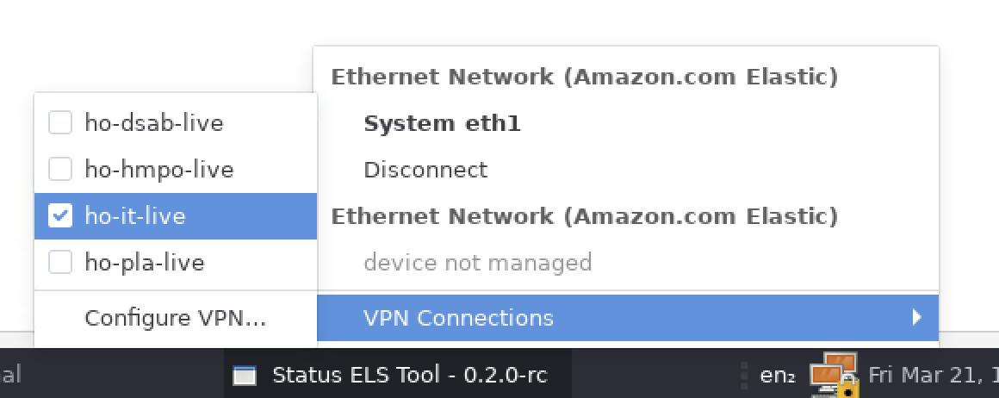
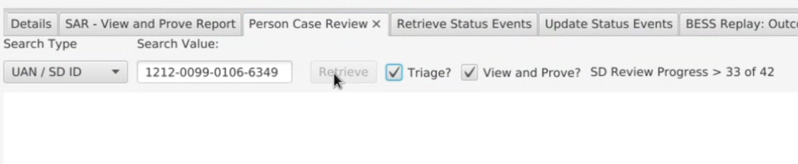
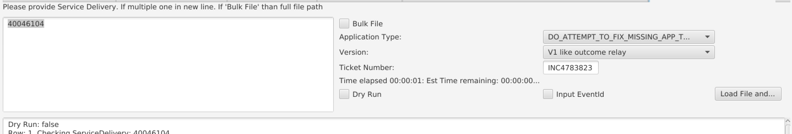
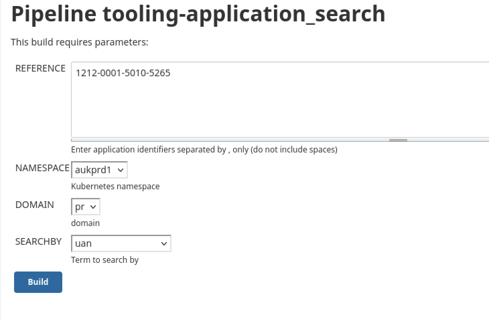
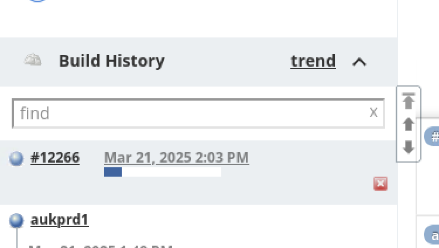
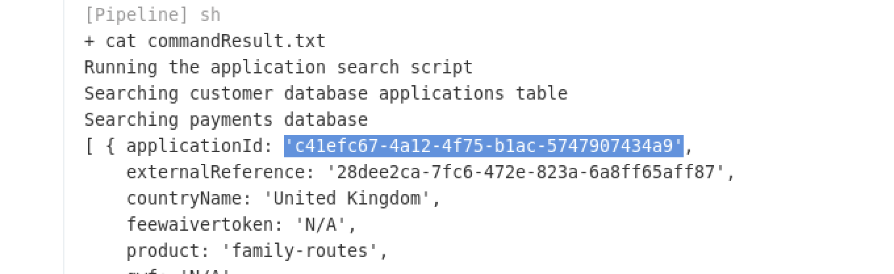
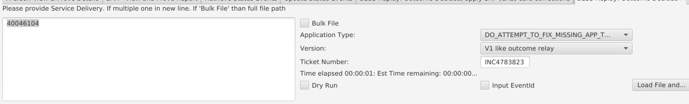

(ctrl shift p)
--- 
- [Numbers and where they go](#numbers-and-where-they-go)
- [Escalation](#escalation)
- [Amazon workspace](#amazon-workspace)
  - [Login](#login)
  - [Tools](#tools)
    - [ELS](#els)
    - [Jenkins app search tooling and AUK1 end point](#jenkins-app-search-tooling-and-auk1-end-point)
    - [AUK2 end point](#auk2-end-point)
  - [AUK2 payment script](#auk2-payment-script)
- [View and Prove tickets](#view-and-prove-tickets)
    - [Live triaging](#live-triaging)
    - [Scenerio - Old grant showing rather than new (CRS)](#scenerio---old-grant-showing-rather-than-new-crs)
    - [Scenerio - redhat, do they have a SAR acount?](#scenerio---redhat-do-they-have-a-sar-acount)
- [Payment tickets](#payment-tickets)
    - [Scenerio - Refund after IHS payment](#scenerio---refund-after-ihs-payment)
    - [Scenerio - incorrect RTW/RTR](#scenerio---incorrect-rtwrtr)

# Numbers and where they go

UAN/CID_CASES -> ATLAS, ELS
EUA -> REDHAT

---

# Escalation

PA CONSULTING -> incorrect status
BIDMU CORRECTION -> personal details i.e. name DOB
DELOITTE -> issues progressing with payment applications

---

# Amazon workspace 

## Login 
 1. use your username `firstname.lastname`
 2. password is workspace password from PASS
 3. use phone MFA 
 4. when in, click the padlock at the bottom left of the desk top 

5. navigate to `ho-it-live`
6. use your LDAP password and LDAP MFA in the same box to log into the VPN

## Tools

### ELS

1. open terminal and cd into ELS
2. run the cmd `sh runLatest.sh`
3. ELS TOOL should open
4. drop down on the left and click pdr1
5. it will freeze - Option + shift + tab
6. find the pop up, click okay 
7. click pdr1 again and select Kibana and add tab
8. username `firstname.lastname`
9. password LDAP
10. close ELS 
11. rerun the cmd on termainal
12. you can then add the tabs you'd like i.e. check person view and proof, retrieve status events, update status events

---

- CHECK PERSON (non evisa) - UAN, Document details -
- SAR VIEW (evisa) - shows how it shows for them
- PERSON CASE REVIEW - shows everything (select what you wanna search)

- RETRIEVE STATUS EVENT - shows the event statuses to get the service delivery number for voiding 
- UPDATE STATUS EVENTS - to void and unvoid status events
- BESS REPLAYS - CRS one for CRS on atlas and the other one for others

### Jenkins app search tooling and AUK1 end point 
1. use jenkins job 1 - you should have the link faved on workspace
2. click build w paramters 

3. insert whatever ref number you have and make sure to change the "search by" to match 

4. click the build under the build queue

5. click the ouput console on the left
6. scroll to the bottom and find the APP ID

7. you should have the url favourited - if not ask Mohammed 
8. right at the end of the url, after the `/` paste the applicants APP ID
9. click expand all
10. for AUK1 cmd+f "payment_made" 
  

### AUK2 end point
1. you should have the url favourited - if not ask Mohammed 
2. right at the end of the url, after the `/` paste the applicants UAN
3. click expand all
4. for AUK2 cmd+f "payment" to find the payment data

## AUK2 payment script
1. open terminal and cd into paymentscript
2. use the cmd `python3.9 main.py [UAN]` to bring up the payment data
3. use `python3.9 main.py [UAN] -i [INC]` to generate a email template for refunds to send to "transactionalservicescorrespondence@homeoffice.gov.uk" 
---
# View and Prove tickets 

### Live triaging 
1. find a passport or BRP number 
2. navigate to status-tooling-pything->triage_rtwr_live_incidents
3. run the cmd `python3.9 main.py -t [PASSPORT/BRP] -n [INSERT NUMBER]`
4. see live status events and grants 

### Scenerio - Old grant showing rather than new (CRS)

1. search their atlas
2. CRS GLOBAL REFERENCE get their CRS_APP number from end of URL
3. run the BRP CARD CORRECTION bess reply on ELSE to correct the grant
4. check UAN on SAR view and prove to see if the grant has changed to the grant.

### Scenerio - redhat, do they have a SAR acount?
---
# Payment tickets 

### Scenerio - Refund after IHS payment
1. if the applicant cancelled app after IHS payment but dont make a visa payment 
2. verify the IHS payment happened by typing IHS and seeing if theres a ref number
3. if so and "payment_failed"
4. the escalate to `Home Office - Transactional Services Team - INC Resolver`

---
### Scenerio - incorrect RTW/RTR

1. check live triage script, check persons and atlas
2. if its wrong grant run a BESS replay and check again
3. if still incorrect PA consaulting

### Scenerio - old grant showing on view and prove

1. check on atlas that the grant they WANT to see exsists
2. check person view and prove to see what grant appears
3. if it is the wrong grant - retrieve status events 
4. take the service delivery number of the incorrect grant and paste it in update status events and check void
5. check again on check person view and prove and see if the correct grant appears - if yes resolve, if no continue
6. if it is an even olde grant - follow the same steps and void that one too
7. check again on check person view and prove and see if the correct grant appears - if yes resolve, if no continue
8. get the service delivery number and run a BESS replay 

9. check again on check person view and prove and see if the correct grant appears - if yes resolve, if no escalate to PA consulting and explain that there is no status event for the grant the applicant wants to see