- [to start](#to-start)
- [to end](#to-end)
- [SSB](#ssb)
- [Commands](#commands)
- [shortcuts](#shortcuts)
- [Tags](#tags)
- [Typical Event History](#typical-event-history)
- [TO NOTE!](#to-note)
- [intune enrolment](#intune-enrolment)
- [PII - Personal Information](#pii---personal-information)
- [PVs and SPVs](#pvs-and-spvs)
  - [if no enrolement](#if-no-enrolement)
  - [example 1](#example-1)
  - [example 2](#example-2)
  - [example 3](#example-3)
  - [exmaple of a PV](#exmaple-of-a-pv)
- [not for work and study (eg. cannot attatch photo, change expiry date on visa )](#not-for-work-and-study-eg-cannot-attatch-photo-change-expiry-date-on-visa-)
  - [also we don't do BRP anymmore - dead route](#also-we-dont-do-brp-anymmore---dead-route)
- [de-merge (or incorrect photo)](#de-merge-or-incorrect-photo)
- [duplicate enrolment](#duplicate-enrolment)
- [reopen application](#reopen-application)
- [missing app](#missing-app)
- [oops error](#oops-error)
- ["Unexpected character" oops error](#unexpected-character-oops-error)
  - [manage document oops error](#manage-document-oops-error)
- [Handle fulfill exceptions](#handle-fulfill-exceptions)
  - [issue -\> simple error. They forgot to put city wrong, DOB correctly. Applicant error not system.](#issue---simple-error-they-forgot-to-put-city-wrong-dob-correctly-applicant-error-not-system)
- [Fbis Fulfilment Exception](#fbis-fulfilment-exception)
- [no task](#no-task)
  - [no error found for app stuck (stuck in system user)](#no-error-found-for-app-stuck-stuck-in-system-user)
  - [ris stuck](#ris-stuck)
- [if stick in A-RIS](#if-stick-in-a-ris)
- [if stuck in A-RIS 2](#if-stuck-in-a-ris-2)
  - [Reallocate task to caseworker](#reallocate-task-to-caseworker)
  - [stuck on further action](#stuck-on-further-action)
  - [ssb error - no biometric enrolment](#ssb-error---no-biometric-enrolment)
  - [ssb error - no SD](#ssb-error---no-sd)
  - [expired ris checks](#expired-ris-checks)
  - [ris checks/prs haven't started](#ris-checksprs-havent-started)
- [no bios - if no resolve send to accenture](#no-bios---if-no-resolve-send-to-accenture)
  - [no bios linked through on ATLAS, no ID Verification files in ATLAS](#no-bios-linked-through-on-atlas-no-id-verification-files-in-atlas)
- [IABS\_VERIFICATION\_ERROR](#iabs_verification_error)
- [FES STUFF w Alez Lams - pt1 (DO NOT USE FIREFOX)](#fes-stuff-w-alez-lams---pt1-do-not-use-firefox)
- [FES STUFF - pt2](#fes-stuff---pt2)
- [FES - pt3](#fes---pt3)
- [FES SQS DLQ WI Start to Finish](#fes-sqs-dlq-wi-start-to-finish)
  - [get AWS CLI creds](#get-aws-cli-creds)
  - [access the SQS FES queue](#access-the-sqs-fes-queue)
  - [getting error messages for Asim](#getting-error-messages-for-asim)
  - [redrive the queue](#redrive-the-queue)
  - [Grey task](#grey-task)
- [HOPS](#hops)
  - [Passport triscans missing from HOPS/ Documents missing?](#passport-triscans-missing-from-hops-documents-missing)
    - [worst case scenerio - message Stuart if nothing on HOPS](#worst-case-scenerio---message-stuart-if-nothing-on-hops)
  - [Docs need deleting from HOPS](#docs-need-deleting-from-hops)
  - [No access to HOPS](#no-access-to-hops)
- [SEND TO PA](#send-to-pa)
  - [Notification needs to be triggered](#notification-needs-to-be-triggered)
  - [Caseworker cannot choose a service delivery](#caseworker-cannot-choose-a-service-delivery)
  - [Unable to remove task](#unable-to-remove-task)
  - [Correct wrong sponser](#correct-wrong-sponser)
  - [Case did not progress to print queue after decide task was completed](#case-did-not-progress-to-print-queue-after-decide-task-was-completed)
  - [502 bad gateway](#502-bad-gateway)
  - [Missing docs](#missing-docs)
  - [CID case has not been migrated to Atlas](#cid-case-has-not-been-migrated-to-atlas)
- [delete tasks/ cases (can send to pa if they can't)](#delete-tasks-cases-can-send-to-pa-if-they-cant)
- [ID verification not on atlas INC4946249](#id-verification-not-on-atlas-inc4946249)
- [Sponser Bio checks expired](#sponser-bio-checks-expired)
- [Case on CID has not been migrated to Atlas properly.](#case-on-cid-has-not-been-migrated-to-atlas-properly)
- [ePMS drop down option missing](#epms-drop-down-option-missing)
- [Bio reuse case](#bio-reuse-case)
- [IOT process incident](#iot-process-incident)
- [DOD () tickets](#dod--tickets)
- [BPM Exceptions](#bpm-exceptions)

# to start
1. cmd `source bash_profile` in home direc
2. `export VAULT_ADDR=https://vault-elb.service.pr.iptho.co.uk:443 && vault login -method=ldap username=nimota.ogunwoolu` - use LDAP password
3. `sh ssb_db_tunnel.sh`
4. use `export PATH="/Users/nimota.ogunwoolu/.local/bin:$PATH"` to use the atlas toolbox 

# to end
1. git push (if changed PAT) - username `N-AO5` and password is your personal access token 

# SSB
1. to get the repo `git clone ssh://git@bitbucket.bics-collaboration.homeoffice.gov.uk/lso/lso-scripts.git`
2. cd lso-scripts
3. cd ssb_tunnel_scripts
4. `export VAULT_ADDR=https://vault-elb.service.pr.iptho.co.uk:443 && vault login -method=ldap username=nimota.ogunwoolu` - use LDAP password
5. `sh ssb_db_tunnel.sh`
6. test with `sh search_all.sh [UAN]` if doesnt work do step 4 again
7. use `sh resend/resend_failed_message_id.sh [error code]` to resend an error
8. DO NOT RESEND DUPLICATE ENROLMENT SSB ERRORS

# Commands 
- `uan2eventhis [UAN]` event history 
- `uan2sddetail [UAN]` get the sd id from a uan 
- `sddetails [SD]` service delivery details 
- `psv [SD]` Atlas link 
- `sh search_all.sh [UAN]` ssb (checking biometric error / error code)
- `sh resend/resend_failed_message_id.sh [error code]` error resend
- `checkSDCorrIDs [SD]` RIS check

# shortcuts
- .missingapp (missing application escalate)
- .ssberror (ssberror resolve)
- .ssbe (ssberror escalate - accenture) - timedout enrolment pa
- .retry (retried exception resolve)
- .resubapp (resubmit app resolve)
- .notask (no task escalate)
- .oops (oops error escalate pa  )
- .escalate (escalate comment)
- .pp (if problems persist resolve)
- .deadline (External Enrolment Past Deadline event resolve)
- .noclearexcep (exeption that won't clear - pa atlas)
- .noexcep (no exception to clear) -  (open up the exception vertical = RIS - send to PA)
- .further (further action overdue)
- .risexpired (ris expired - send to accenture)
- .risstuck (ris stuck - send to accenture)
- .cwsaid (repeat what the cw said escalate)
- .facebios (facial images need to be linked - accenture)
- .triscans (resolve)
- .authhops (get hops permissions again)
- .chase1 (cw chase 1)
- .reenroll (cw reenroll when no bios)
- .dochops (doc deletion on hops, resolve)
- .userhops (user access on hops, resolve)
- .sys (stuck in sys user, no ris stuck, pa)
- .linkbios (bios but not linked to app, escalate accenture)
- .merge (de-merge, escalate HODigital - IBM Managed Identities - INC)
- .reassign (reassign task, escalate to pa)
- .personal (PII in the notes, mst be reopened by C/W)

# Tags 
- WS-IncSponsor
- WS-Registration
- WS-Merge
- **WS-Missing-App** - missing application (escalate to deloitte, .missingapp)
- **WS-OopsError** - oops error
- WS-Hops-img
- **WS-CW-R** - case worker return
- WS- MDS-Missing
- WS-NoTask
- **WS-Abort** - cw accidentally aborted an application and needs to reinstate it 
- WS-Notification-Issue
- Not-WS
- **WS-No-Issue** - no issue
- **WS-SysUser** - stuck in system user, ris check completed - PA,
- **WS-RIS-Stuck** - incomplete ris checks (esclate to acccenture)
- WS-RIS-ExtEnr - external_enrolment-past_deadline -> check if SSB error RIS-308, if yes resend then resolve case, if not resolve .deadline
- **WS-NoRIS** - no ris checks requested (PA)
- **WS-Bios** - resolved tickets 
- WS-RI-Person
- WS-RI-Group
- WS-DropD-Missing
- **WS-FBIS-Exception** - Fbis Fulfilment Exception
- **WS-HandffE** - handle fulfilment exceptions
- WS-HDME
- **WS-CAE** - consider application exceptions
- WS-Exception
- **C/W ...**

# Typical Event History 

1. Application is received
2. Biometric enrollment (finger print scan process, photo) (if not- do SSB check)
3. RIS checks(complete) - security checks
4. Decide / decision complete (or something similar)
5. Ready for consider/ Ready for reconsider (main thing you should see)
6. When its reconsider registration -> go back and check RIS(expire in 2month), check Sdcorrelation (command checkSDCorrIDs [service delivery ID])
7. Service delivery complete. (sometimes not showing)

# TO NOTE!

1. FYI for PIS: Atlas - FE - Document Management if you're not sure and you would like to escalate please send to "HODDaT - Immigration Technology Portfolio - Mastek L3 Service Ops" 
2. When resolving the oops error that is caused by double quotes please use the tag WS-Oops-Quotes and add the problem ticket: PRB0055463
3. f you come across any HOPS issues around being unable to delete documents from HOPS, please associate to PRB0055459 if it’s applicable and then assign to HODDaT - Immigration Technology Portfolio - Mastek L3 Service Ops. 
4. if you’re seeing cases with any biometrics stuck on 30/31 july. Please send them to accenture.
Note on the ticket it was a biographic fault on 31st July too please.
5. We have a new problem ticket for an oops error caused by multiple UANs attached to a single SD. This can be identified in Kibana as it is a MS-CHECK-VALIDATE with an error code of 49. Please see the following example:
https://elk-pr2-kibana.service.ops.iptho.co.uk/goto/a6bf570f09ccad3f35c92fb102979e4c
If you have this oops error please attach the problem ticket PRB0055550 and tag with WS-Oops49
6. Restrictated cases unable to claim tasks assing to Atlas FE Team - Shashikant Gurav - Assignment Group on Snow
Atlas - FE - L3 Support

# intune enrolment 
- Backup your .kube &.ssh folders to digital onedrive as well as any files or scripts you want to keep inc bookmarks and if using a password manager the file for this.
- Complete the wipe and reinstall following the guide in the email.
- Once logged in and the device is compliant you can start adding your programs back and restore from your backup for your files and bookmarks.
- Once i did this, i then started setup, get tunnelblick / openvpn and get the config files installed .
- On your terminal install brew then brew install python, kubectl
- Install vault by using the commands here, https://developer.hashicorp.com/vault/tutorials/get-started/install-binary thenexport VAULT_ADDR=https://vault-elb.service.pr.iptho.co.uk:443 && vault login -method=ldap username=<LDAP_USERNAME>
- Add your .kube & .ssh folder to your home folder, you may need to change the permissions of the ssh folder in order to get toolbox installed run this command
chmod 700 ~/.ssh && chmod 600 ~/.ssh/{config,id_rsa} && chmod 644 ~/.ssh/id_rsa.pub
- Install toolbox curl -s -u <BITBUCKET_USERNAME> "https://bitbucket.bics-collaboration.homeoffice.gov.uk/projects/SLO/repos/atlas-toolbox/raw/install.sh?at=refs%2Fheads%2Fmaster" | sh
- Atlas did install but i got an error about my path not being valid and to run this command which worked and I can use toolbox.
uv tool update-shel
- I also had to re add read only account to my AWS console profile when switching roles 284234763074 & TF_ReadOnly
To add to that workspaces needs setting up again and the registration code is wsdub+UZPCZR.  If anyone needs a hand or has questions give me a shout
- I could not get the mac to open the VPN bundles i downloaded from the confluence page du to malware issues, Here are the bundles and they should work with openvpn but they also work with tunnelblick [see -> ]

# PII - Personal Information
What to do if you suspect a ticket contains PII:
1. Stop all work on the ticket.
2. Update the Work Notes if applicable, i.e., "PII check".
3. Escalate to your Team Lead.
4. Consider rejecting the ticket with the resolution notes as per KB0025522.
 Any ticket containing PII within the Work Notes and / or any other non-editable field should be rejected.
Under no circumstances should the ticket be assigned over to another Team with PII in-situ.
If you have any further questions around PII within ServiceNow tickets please discuss with your Team Lead in the first instance.
 Operational Knowledge - ServiceNow - Updating Customer Notes in Incidents - Basic Templates | ServiceNow

# PVs and SPVs 

## if no enrolement 
1. awaiting info ask if theyre sure the app went to enrolment 
2. UERN and case type 

## example 1

1. short sla so must be done quickly
2. the team thsi is for is not on service 
3. message laura chisom - homeoffice emplypee responsible for on boarding 

## example 2 

1. check the event history - looks like stuck in ris
2. checkcorrids - stuck in ris
3. good thing to do for SPVs - sddetails should say priority or something 
4. this is curtailment - not prority
5. if this was an SPV - no ris done in a day then it's stuck in 
6. this is a normal ticket - it's still wihtin the normal ris time frame (look at checksdcorrids dates) so theres nothing accenture can do, rory is waiting to see what to do next

## example 3
1. check sddetails 
2. if not SPV - tag **not spv** same for pvs

## exmaple of a PV 

1. check ssb - weird ssb errors, probably due to an outage or something (IPT-00)
2. resend them all 
3. theyve cleared - event history again and the application has progressed
4. resolve
5. rory uses is run all script and it runs all the scripts he's written

6. they check all the apps with that ssb error -> creates a file that lists them -> checks the ones that have timed out -> creates a list of uans that have been stuck -> searches the uan to find the resend id and creates a file -> resend script sends resends every 20 seconds

# not for work and study (eg. cannot attatch photo, change expiry date on visa )

1. go to slack channel #sas-tranche-1-2-3
2. "@sas_im_team [INC number] - The ticket is not for work and study, can this be reassigned?"
3. remove name from assigned on ticket 

## also we don't do BRP anymmore - dead route
1. resolve with -
"
Hi,

As BRP RS is a dead route it will not produce a BRP or update the status for the applicant.

Please contact your supervisor about getting the applicant onto an evisa.

Should problems persist, please contact the ITnow Service Desk.
Please provide as much information as possible for SAS L2 to investigate further.

Kind regards,
L2
"

# de-merge (or incorrect photo)
1. if the picture is of someone else either the C/W has uploaded the wrong photo
2. OR there has been an incorrect merge

1. send the INC number to the #merge-identity-queries
2. copy in your inc number
3. copy the supplier ref that they give as a reply
4. add to supplier ref box in main details of the ticket
5. send to "HODigital - IBM Managed Identities - INC"
6. ask them to investigate the potential merge merger
7.  **ws-merge**

# duplicate enrolment 
1. sent to accenture 

# reopen application 
1. sd aborted in error - No option given to raise reconsideration 
2. send to PA consultant

# missing app
1. search the UAN on atlas 
2. if there - resolve no fault found
3. if not -> deloitte
4. .missingapp
5. tag **ws-missingapp**
6. resolve w .resubapp
7. if not resolved after resub - PA
8. if stuck at RIS - APPLICANT_RESOLVE_IDENTITY_STARTED, check SSB (RIS-033) and replay it 

# oops error
1. do `uan2eventhis` 
2. decison should say "TASK_COMPLETED"
3. if not 

4. copy the correlation ID 
5. search the ID in speech marks
6. change the time frame to quick -> last 30 days (but if you have the exact time and date you can search absolute)
7. add (click the little plus) message and severity on the left side 
8. there should be one green bar in the graph
9. share -> permalinks -> short URL
10. in wn .oops 
11. fill in the URL and the sddetails 
12. escalate to PA consulting atlas - .esclate
13. tag **ws-oopserror**

# "Unexpected character" oops error
1. search on kibana
2. add severity and message 
3. open up the MS-CHECK-VALIDATE little arrow

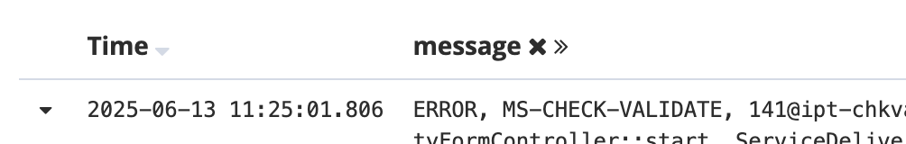

4. cmd + F the caused by to find the information (code: 73, 100, 84, 69 )

5. on terminal use `uan2eventhis` 
6. copy the path

7. open up finder and cmd + shift + G and paste the path for the file
8. open it up in vscode or a text editor
9. cmd + find and search the sentence that was in the error MUST BE CANCELLLATION REQUREST
10. within that event history 
11. Due to unescaped characters needs updated to \\\ rather than one \

Example:
Before the \"escaped character looked like this
Before the \\\" escaped character looked like this

12. do this for both end of the sentence 

13. find where it collapses (77) and cheange the date by one second at the top and at the bottom

14. collapse the the section that the changes were made and copy 

1.   paste in this swagger page (click try it out) - https://ipt-ingestion-services-prd1-prd1.service.pr.iptho.co.uk/dataplatform-services/api-doc/#/Event%20History%20V3%20APIs/DPS-EVENT-PUT-005 
2.   Execute and the code should be 200

## manage document oops error

i.e. https://elk-pr2-kibana.service.ops.iptho.co.uk/goto/a9ba284988b3449d9dbc9493008e8b92

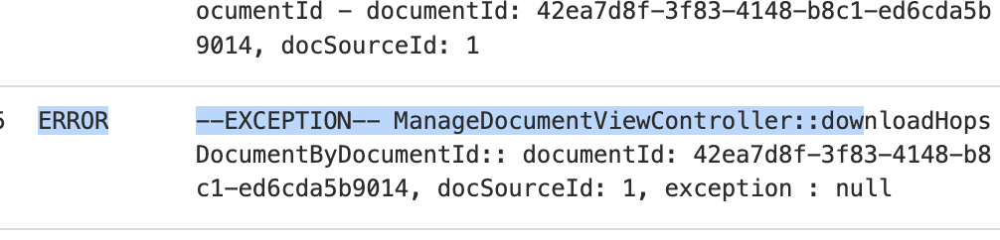

1. send to HODDaT - Immigration Technology Portfolio - Mastek L3 Service Ops

# Handle fulfill exceptions 
## issue -> simple error. They forgot to put city wrong, DOB correctly. Applicant error not system.

1. Put the UAN on tasklist if uan brings nothing search their name 
2. copy the entire exception and paste in wn - REMOVE THE NAME 
3. fix the formatting 
4. get the `sddetails [SD]` fom terminal 
5. paste in wn
6. .noclearexcep
7.  assign to **PA consulting -Atlas -l3 support**
8.  tag **WS-Handffe**

# Fbis Fulfilment Exception 
1. check atlas to see of the exception is still there
2. check the UAN on tasklist 
3. retry the exception
4. if gone, double check on psv and resolve -> .retry
5. if not -> PA constulating, include sddetails -> .escalate

# no task

## no error found for app stuck (stuck in system user)
1. check the url given by cw (copy after the /Caseworking, paste in normal atlas address in same spot)
2. check ssb -> no error
3. check ris check -> no ris stuck (if ris done recently but incomplete - still send to pa) [alex said reply to cw saying - message the C/W saying that they need to get in contact with the idops team (another casworking team) to expedite these ]
4. says 'COMPLETE_FURTHER_ACTION' but theres no further action task
5. escalate to pa consulting - tell them you checked ris .sys

7. .escalate

## ris stuck

# if stick in A-RIS
1. double check it's not a merged identity on psv
2. go to all facial images and make sure all look like the same person
3. if not then de-merge

# if stuck in A-RIS 2
1. replay ssb 
2. if it's stuck at IDENT1 then there is likely a exception (doesn't show up on PSV only tasklist)

## Reallocate task to caseworker

1. .reaasign
2. send to PA atlas
3. add the service celivery details

## stuck on further action 
1. check `uan2eventhis [UAN]`
2. `uan2sddetail [UAN]` for further details
3. If you see " -READY_FOR_CONSIDERATION - " the application has gone through
4. use `psv [SD]` to see the consider/reconsider event history
5. check the case details - if theres a futher action delay from the customer (Comment .further)
6. the reconsider should go through after

## ssb error - no biometric enrolment
1. `uan2eventhis [UAN]`
2. appears to be stuck in ris (ris checks havent started)
3. ris checks start when biometric enrollment has been completed 
4. check psv - see if biometric enrollment has been completed  - not on atlas
5. do ssb check `sh search_all.sh [UAN]` 
6. If there is an argument in the live table - theres an error (if no error message, then there is nothing wrong)
7. run `sh resend/resend_failed_message_id.sh [error code]`
8. run `sh search_all.sh [UAN]`  again
9. if there are is no longer an error, check if the the enrolment has gone through 
10. if the error code is the same, wait and rerun cmd
11. if the error code is diffrent - send to accenture
12. run `uan2eventhis [UAN]` - there should now be a biometric enrolment
13. check psv as well - go into the grant - case details - application serice delivery details 
14. tag as **ws-bios**

## ssb error - no SD
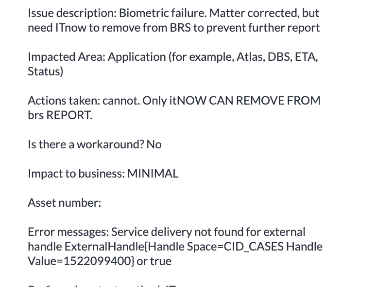

1. do ssb and the error should match what cw said
2. run `uan2eventhis` - if there is no sd, send to deloitte
3. if there is, send to PA and ask them to resubmit the case with the UAN the C/W provided

## expired ris checks
1. check `uan2eventhis`
2. ris checks appear completed
3. `checkSDCorrIDs [SD]` - says all ris checks complete but might not be the case
4. `psv [SD]` check the case and see the case card - ris checks done over 2 months ago t4 expired
5. send to accenture

## ris checks/prs haven't started
1. after checking event history, psv and ris checks
2. send to PA consultant - add sddetails

# no bios - if no resolve send to accenture
## no bios linked through on ATLAS, no ID Verification files in ATLAS

1. check atlas -> open the application -> if there biometric enrolment? -> resolve

2. if biometric enrolment is timedout -> check ssb -> if there is a timedout enrolment on ssb replay it
3. if its a late enrol, resolve with the message above
3. if not check facial images (if one says BRP - send to accenture, see fatima for message) 
4. message the group chat to see if the enrolment does exist

4. if yes, copy the deets and send to accenture telling them to link the enrolment .linkbios
5. if not, close and ask cw to enroll
6. .reenroll

# IABS_VERIFICATION_ERROR

1. no task so check the event history
   
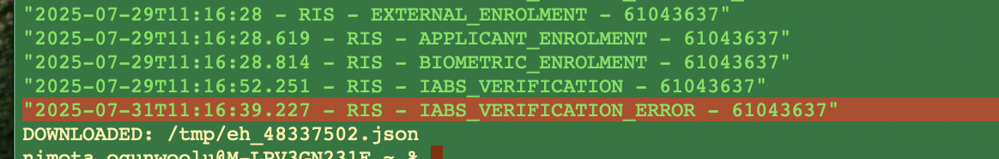

2. get the enrolment from the group chat
3. send to Leidos - IABS - Incident Resolvers - INC
4. resolve with:

Hi,

L2 have received this response from IDENT1, please see below.

The IDENT1 searches timed out due to the P1 HO SDWAN network incident INC5143648. The timeout is the final response from IABS and the transaction has been housekept in line with our security requirements. The business process is for the IFB to manually process a new IDENT1 search and update the results manually on your systen. Alternatively you can re-enrol on IABS with a new UERN

The IFB have no access to SNOW and can be contacted on email: yyfma-IFB@homeoffice.gov.uk

This incident has now been marked as resolved

Should problems persist, please contact the ITnow Service Desk.
Please provide as much information as possible for SAS L2 to investigate further.

Kind regards,
L2

# FES STUFF w Alez Lams - pt1 (DO NOT USE FIREFOX)
- DLQ dead letter queue - Means the messages were send but not recieved and therefore end up in the DLQ 
- SQS - simple message queues on amazon
- change the thingy to 100 messges per page
- note the queues you've done - only do ones with messages available and are DLQ

1. Log in work spaces - use nimota.ogunwoolu, LDAP, workspace MFA 
2. Go to the amazon sqs queue - https://eu-west-1.console.aws.amazon.com/sqs/v3/home?region=eu-west-1#/queues 
3. The first one - is v1 doesnt have v2 in the name 
4. V1s can only be replayed one at a time 
5. In the second DLQ Tool for v1 
6. Paste the name of the dlq you're doing - you wanna see that the number in the sqs is the same - paste in BRUNO - get list of all the letters
7. run it look at the list, copy the ACTUAL name of 

1. copy the actual name - and paste in get DLQ message
x

8. so the top two line and bottom two are the brackets on the next so don't count, each message is 4 lines so..
9. max number of lines - 4/ 4
10. credits expire
11. open in new tab - the first one is v1, copy the ARN into the value

1.  paste in source ARN

13. go back to the queue - go to redrive, copy the long number 

14. paste in the destination into the command 
15. paste the cmd into the terminal 

# FES STUFF - pt2
1. log into workspaces
2. go to the amazon SQS - search 'sqs-fes'
3. v1s are the ones that dont have v2 on the end
4. v1s can be replayed one at a time 
5. v2s can be replayed as a group

# FES - pt3
1. rorys script gives us the corrids for hops stuff
2. put the bruno text from the specific queue
3. paste into rory's script, add the argument to reformate into json
4. once we have the json put into kibana
5. dependng on the dlq, either fes 30 or 40
6. ssb fes 40 and hops is fes 30 
7. each line on kibana has it own corrid and copy and paste all of the of them into the excel file
8. 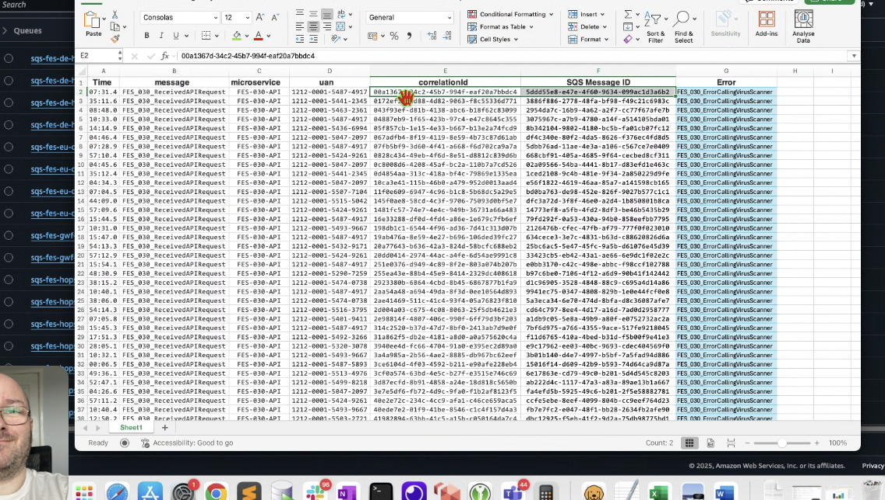
9. search the corrids to find the error message and put them into the excel spreadsheet

# FES SQS DLQ WI Start to Finish

## get AWS CLI creds
1. request pr access on PASS
   
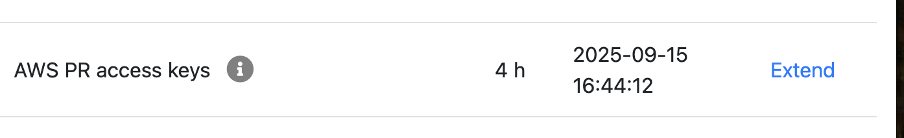

1. cd into ws_temporary_cred
2. run the cmd ` ./getCreds.sh `
3. AWS Account: pr
4. fill in LDAP user name and pass
5. run `export AWS_SHARED_CREDENTIALS_FILE=~/.iptcreds/eu-west-1/aws_pr` to make creds persistant 
6. run `aws s3 ls` to make sure you have access
7. run `rm ~/.iptcreds/eu-west-1/vault_pr` to clear previous creds

## access the SQS FES queue
1. Make sure you have all the applicaiton required:
   1. Access to AWS SQS
   2. Aws CLI downloaded and credentials done
   3. Bruno with the necessary collections
2. Go to the amazon sqs queue - https://eu-west-1.console.aws.amazon.com/sqs/v3/home?region=eu-west-1#/queues 
3. click your account in top right corner - 

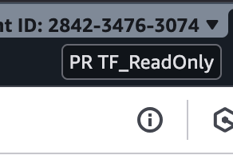

4. search 'sqs-fes'
5. click the cog at the to right corner and allow 100 messages at a time
6. order it by messages available descending 
7. DO NOT REDRIVE - sqs-fes-pcdp-dispatcher-in-dlq-fesprd1 (not responsible) & sqs-fes-ssb-dispatcher-in-dlq-fesprd1 (doesn't work)

## getting error messages for Asim
1. go on BRUNO and click V1 or V2 depending on which queue you are doing 
2. press the top right allow on the screen
3. copy the name of the queue you wanna do 
4. click the "Get DLQ Messages" and paste the name Q

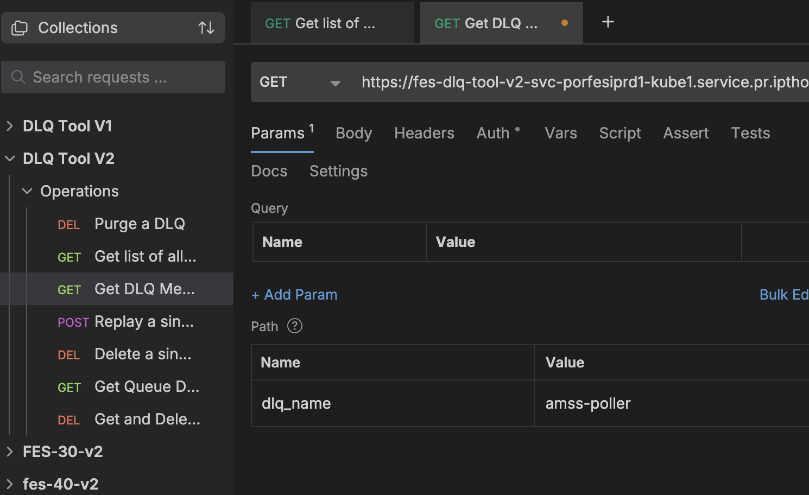

5. click the arrow on the top right
6. this shows there is a list on bodyless messages - there are 59 messages in the queue but it says "DLQ is empty"

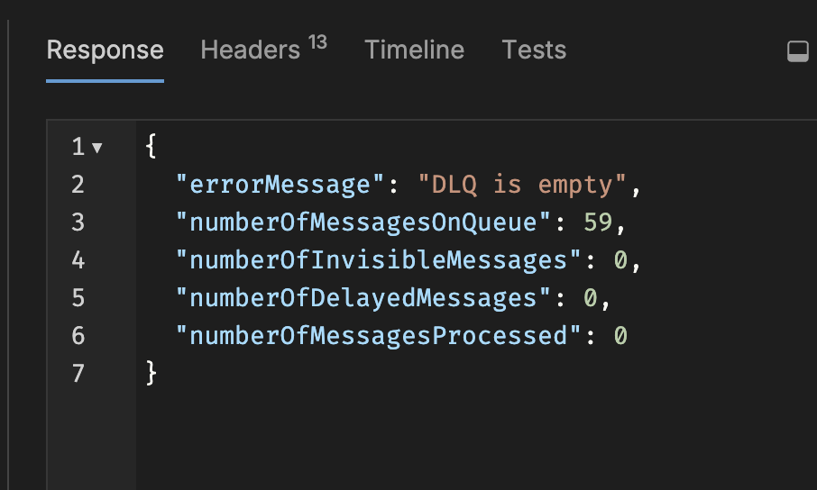

7. click Get and Delete
8. make sure the URL says false so it shows the bodyless messages but not delete them

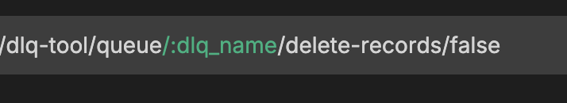

9. go to Get and Delete Bodiless Messages 
10. run it as false to see that they are bodiless 
11. then run as true and it'll delete them and leave the tickets that aren't, they should be gone
12. If no bodiless messages, output should look like this:

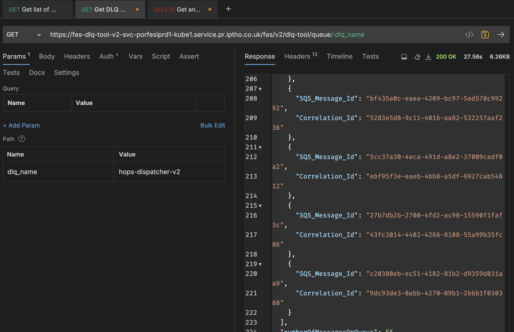

1. paste the bruno text output into the SQS query repo -> BrunoSource.txt
2. run `sh build_json.sh BrunoSource.txt `
3. copy the output 
4. open kinbana and click visulisw on the left hand side list
5. search anjy, click  Anjy's-PBWS-SQS-FES-VISU
6. edit the query and paste the output from terminal
7. change to last 30 days 
8. scoll to the bottom and click export [raw or formatted is fine]
9. open up the file created
10. adjust the headings (shift them over to make them line up tp the right data)
11. add filter and create a new csv
12. make sur e the corrids match - copy it over into the first one
13. save and send to Stuart

## redrive the queue
1. use the cmd - 
`aws sqs start-message-move-task \
    --source-arn arn:aws:sqs:eu-west-1:284234763074:sqs-fes-030-v2-amss-poller-in-dlq-fesprd1 \
    --destination-arn arn:aws:sqs:eu-west-1:284234763074:sqs-fes-030-v2-amss-poller-in-fesprd1 \
    --max-number-of-messages-per-second 250`
2. paste in sublime to easily edit and replace the source arn with -

3. and the destination with -

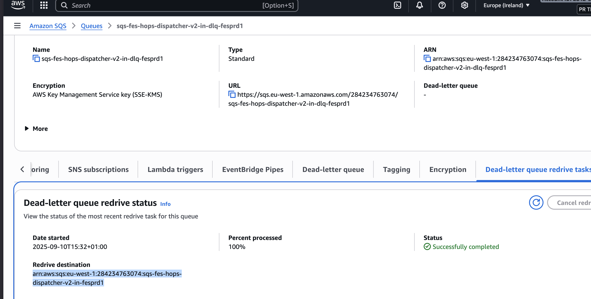

4. should look like this - 

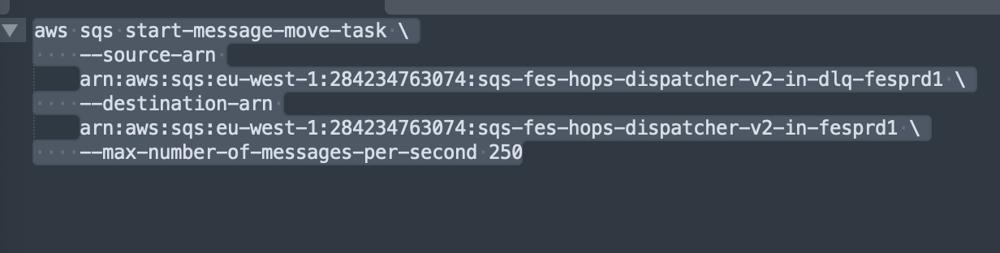

5. you should get this output 

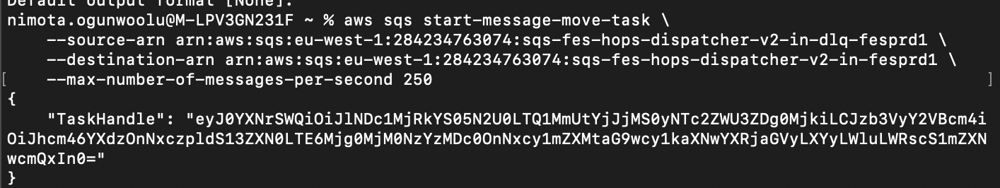

6. check aws console and you should see messages in flight

## Grey task 
 .ssbe

# HOPS 
## Passport triscans missing from HOPS/ Documents missing?

1. check on HOPS to see if there are docs on there 
2. if there are just in case, double check on kibana 
3. search the uan on the Fes Kibana and see the time that there is the APIsent and API recieved
4. this in the communication between TLS and us

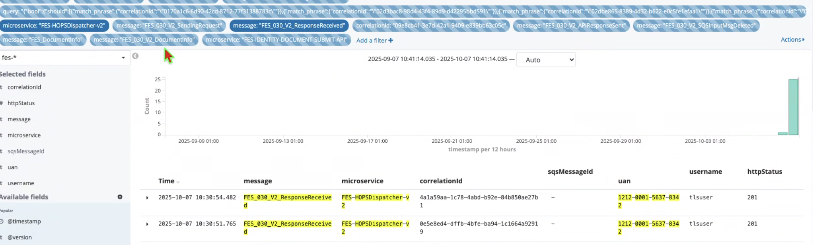

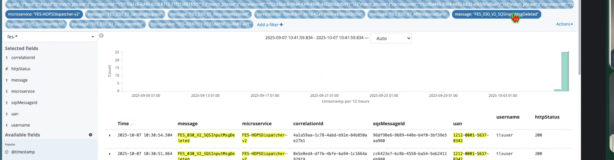

### worst case scenerio - message Stuart if nothing on HOPS
1. Triscans are missing from HOPS 
2. resolve with no fault found - "We have checked HOPS and can see that the Document is missing.

In addition we have checked our log files and have never received the Document.

Please raise the fact the Document is missing with the SRS team as the supplier will have to check if they still have the document(s) and resend.

Kind regards,
SAS L2"

## Docs need deleting from HOPS
1. assign to self and change to in progress -> save
2. resolve .dochops2

## No access to HOPS 
1. assign to self and change to in progress -> save
2. resolve .authhops

# SEND TO PA

## Notification needs to be triggered 

1. copy what cw said 
2. send to PA atlas
3. add the sd

## Caseworker cannot choose a service delivery

1. copy what cw said 
2. .cwsaid
3. send to PA atlas
4. add the sd

## Unable to remove task

1. copy what cw said 
2. .cwsaid
3. send to PA atlas
4. add the sd

## Correct wrong sponser

1. assigned wrong sponder person to case
2. send to pa 

## Case did not progress to print queue after decide task was completed

1. check if any errors
2. if no send to pa
3. .cwsaid

## 502 bad gateway
1. send to pa
2. .cwsai

## Missing docs

1. resolve with .triscans

## CID case has not been migrated to Atlas

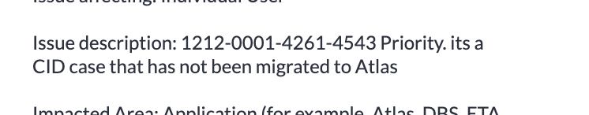

1. send to pa
2. say CID case that the CID case hasnt migrated
3. add sddetails

# delete tasks/ cases (can send to pa if they can't)
1. resolve .deltask

# ID verification not on atlas INC4946249 

1. asked the chat if theres an enrolment 
2. the chat says no 
3. send to deloitte and ask if there is an issue with the submission
4. -

# Sponser Bio checks expired

1. checked on event history and atlas

2. send to accenture - they will re do them

# Case on CID has not been migrated to Atlas properly. 

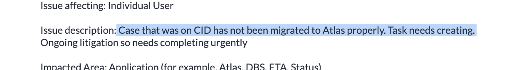

1. check that the application is NOT outside of the 240 day retention period using the jenkins job - https://accessuk-support-jenkins-dtzo-kops1.service.ops.iptho.co.uk/job/tooling-jobs/job/tooling-application_search/
2. if not, send to Deloite

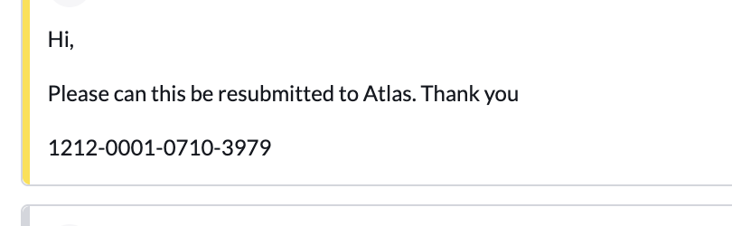

# ePMS drop down option missing

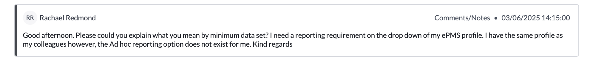

1. email to ePMSSupportRequests@homeoffice.gov.uk,  CC.  Daniel.Webster3@homeoffice.gov.uk
2. state all the details, so username, contact information, description of problem that drop down menu is missing.  
3. include the incident number

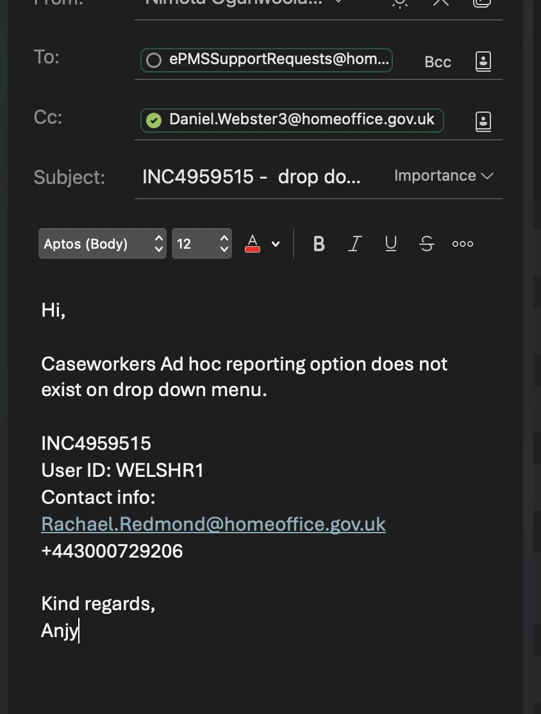

4. They should then email you back stating they’re made profile changes after wards user can test and confirm if working.
5. then do an awaitng info for cw to say to fixed 
6. resolve

# Bio reuse case

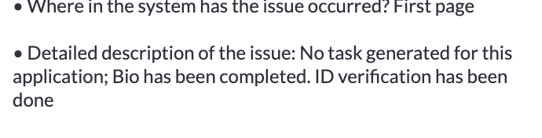

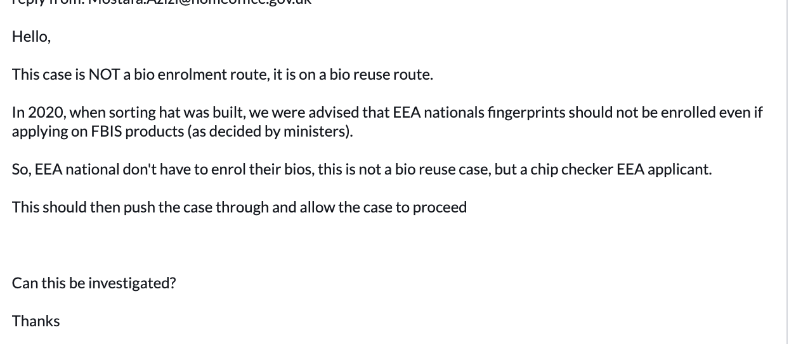

1. Send to accenture asking them to help with a bio reuse case

# IOT process incident 
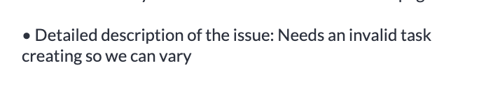

1. close the incident and the the C/W that they need to follow the IOT () process.

# DOD () tickets
DOD  outputs whats on Atlas
1. open up the DOD queue
2. follow the WI given
3. mastek is the first supporT team - i.e they'll you its an access issue, send to PA
4. if you wanna use the URL C/W put in the ticket use this as a precurser - https://dod-dashboard-prd1-kube1.service.pr.iptho.co.uk
5. If there is a surge there is probably a P2, link the incidents to the parent

# BPM Exceptions
1. log into - https://brpfsoaap-prd1.service.pr.iptho.co.uk/bpm/workspace/faces/jsf/worklist/worklist.jspx
2. see this journual (for ports and borders but theres w&s stuff) - https://homeofficegovuk-my.sharepoint.com/personal/nazrul_islam_digital_homeoffice_gov_uk/_la[…]-42f0-89fe-4ae73284e0bc%2F%29&wdorigin=NavigationUrl
3. check here for info if a have to raise a ticket - no more brp do hotd
4. common exception handler, DO NOT RETRY. we can't resolve so a ticket must be raised - both errors can be in the same ticket (just the title)
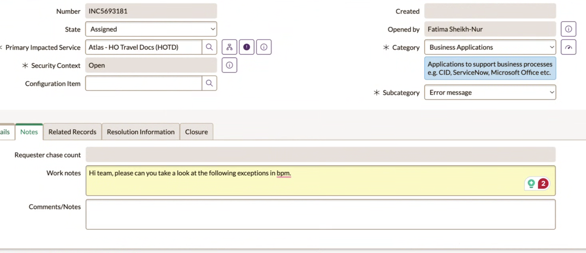
5. assign to Sreenivas Rumandla - can notify him on slack as well
6. he'll reply and tell you to ask the c/w to do something like fix the dob
7. IPTOCFManagement (retry) - the whole error has to be in the ticket, one ticket per error
8. Laura Bessant <laura.bessant1@homeoffice.gov.uk> for Travel Document Correction (HOTDS)
9. 
