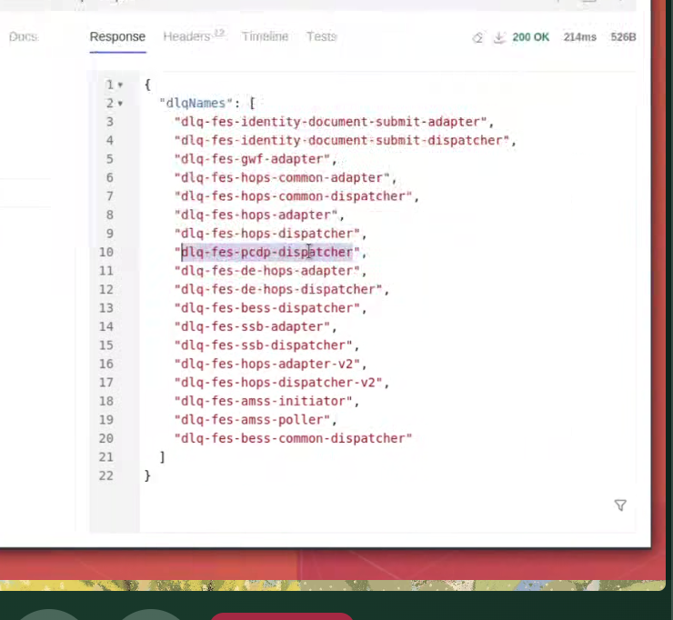

- [to start](#to-start)
- [to end](#to-end)
- [SSB](#ssb)
- [Commands](#commands)
- [shortcuts](#shortcuts)
- [Tags](#tags)
- [Typical Event History](#typical-event-history)
- [PVs and SPVs](#pvs-and-spvs)
  - [example 1](#example-1)
  - [example 2](#example-2)
  - [example 3](#example-3)
  - [exmaple of a PV](#exmaple-of-a-pv)
- [not for work and study (eg. cannot attatch photo, change expiry date on visa )](#not-for-work-and-study-eg-cannot-attatch-photo-change-expiry-date-on-visa-)
  - [also we don't do BRP anymmore - dead route](#also-we-dont-do-brp-anymmore---dead-route)
- [de-merge](#de-merge)
- [duplicate enrolment](#duplicate-enrolment)
- [reopen application](#reopen-application)
- [missing app](#missing-app)
- [oops error](#oops-error)
- ["Unexpected character" oops error](#unexpected-character-oops-error)
- [Handle fulfill exceptions](#handle-fulfill-exceptions)
  - [issue -\> simple error. They forgot to put city wrong, DOB correctly. Applicant error not system.](#issue---simple-error-they-forgot-to-put-city-wrong-dob-correctly-applicant-error-not-system)
- [Fbis Fulfilment Exception](#fbis-fulfilment-exception)
- [no task](#no-task)
  - [no error found for app stuck (stuck in system user)](#no-error-found-for-app-stuck-stuck-in-system-user)
  - [stuck on further action](#stuck-on-further-action)
  - [ssb error - no biometric enrolment](#ssb-error---no-biometric-enrolment)
  - [ssb error - no SD](#ssb-error---no-sd)
  - [expired ris checks](#expired-ris-checks)
  - [ris checks haven't started](#ris-checks-havent-started)
- [no bios - if no resolve send to accenture](#no-bios---if-no-resolve-send-to-accenture)
  - [no bios linked through on ATLAS, no ID Verification files in ATLAS](#no-bios-linked-through-on-atlas-no-id-verification-files-in-atlas)
- [FES STUFF w Alez Lams](#fes-stuff-w-alez-lams)
  - [Grey task](#grey-task)
- [HOPS](#hops)
  - [Passport triscans missing from HOPS/ Documents missing?](#passport-triscans-missing-from-hops-documents-missing)
  - [Docs need deleting from HOPS](#docs-need-deleting-from-hops)
  - [No access to HOPS](#no-access-to-hops)
- [SEND TO PA](#send-to-pa)
  - [Notification needs to be triggered](#notification-needs-to-be-triggered)
  - [Caseworker cannot choose a service delivery](#caseworker-cannot-choose-a-service-delivery)
  - [Reallocate task to caseworker](#reallocate-task-to-caseworker)
  - [Unable to remove task](#unable-to-remove-task)
- [Correct wrong sponser](#correct-wrong-sponser)
  - [Case did not progress to print queue after decide task was completed](#case-did-not-progress-to-print-queue-after-decide-task-was-completed)
- [502 bad gateway](#502-bad-gateway)
  - [Missing docs](#missing-docs)
  - [delete tasks](#delete-tasks)
- [ID verification not on atlas INC4946249](#id-verification-not-on-atlas-inc4946249)
- [Sponser Bio checks expired](#sponser-bio-checks-expired)
- [Case on CID has not been migrated to Atlas properly.](#case-on-cid-has-not-been-migrated-to-atlas-properly)
  - [ePMS drop down option missing](#epms-drop-down-option-missing)

# to start
1. cmd `source bash_profile` in home direc
2. `export VAULT_ADDR=https://vault-elb.service.pr.iptho.co.uk:443 && vault login -method=ldap username=nimota.ogunwoolu` - use LDAP password
3. `sh ssb_db_tunnel.sh`
4. use `export PATH="/Users/nimota.ogunwoolu/.local/bin:$PATH"` to use the atlas toolbox 

# to end
1. git push (if changed PAT) - username `N-AO5` and password is your personal access token 

# SSB
1. to get the repo `git clone ssh://git@bitbucket.bics-collaboration.homeoffice.gov.uk/lso/lso-scripts.git`
2. cd lso-scripts
3. cd ssb_tunnel_scripts
4. `export VAULT_ADDR=https://vault-elb.service.pr.iptho.co.uk:443 && vault login -method=ldap username=nimota.ogunwoolu` - use LDAP password
5. `sh ssb_db_tunnel.sh`
6. test with `sh search_all.sh [UAN]` if doesnt work do step 4 again
7. use `sh resend/resend_failed_message_id.sh [error code]` to resend an error
8. DO NOT RESEND DUPLICATE ENROLMENT SSB ERRORS

# Commands 
- `uan2eventhis [UAN]` event history 
- `uan2sddetail [UAN]` get the sd id from a uan 
- `sddetails [SD]` service delivery details 
- `psv [SD]` Atlas link 
- `sh search_all.sh [UAN]` ssb (checking biometric error / error code)
- `sh resend/resend_failed_message_id.sh [error code]` error resend
- `checkSDCorrIDs [SD]` RIS check

# shortcuts
- .missingapp (missing application escalate)
- .ssberror (ssberror resolve)
- .ssbe (ssberror escalate - accenture)
- .retry (retried exception resolve)
- .resubapp (resubmit app resolve)
- .notask (no task escalate)
- .oops (oops error escalate )
- .escalate (escalate comment)
- .pp (if problems persist resolve)
- .deadline (External Enrolment Past Deadline event resolve)
- .noclearexcep (exeption that won't clear - pa atlas)
- .noexcep (no exception to clear) -  (open up the exception vertical = RIS - send to PA)
- .further (further action overdue)
- .risexpired (ris expired - send to accenture)
- .risstuck (ris stuck - send to accenture)
- .cwsaid (repeat what the cw said escalate)
- .facebios (facial images need to be linked - accenture)
- .triscans (resolve)
- .authhops (get hops permissions again)
- .chase1 (cw chase 1)
- .reenroll (cw reenroll when no bios)
- .dochops (doc deletion on hops, resolve)
- .userhops (user access on hops, resolve)
- .sys (stuck in sys user, no ris stuck, pa)
- .linkbios (bios but not linked to app, escalate accenture)

# Tags 
- WS-IncSponsor
- WS-Registration
- WS-Merge
- **WS-Missing-App** - missing application (escalate to deloitte, .missingapp)
- **WS-OopsError** - oops error
- WS-Hops-img
- **WS-CW-R** - case worker return
- WS- MDS-Missing
- WS-NoTask
- **WS-Abort** - cw accidentally aborted an application and needs to reinstate it 
- WS-Notification-Issue
- Not-WS
- **WS-No-Issue** - no issue
- WS-SysUser
- **WS-RIS-Stuck** - incomplete ris checks (esclate to acccenture)
- WS-RIS-ExtEnr - external_enrolment-past_deadline -> resolve case
- **WS-NoRIS** - no ris checks requested (PA_)
- **WS-Bios** - resolved tickets 
- WS-RI-Person
- WS-RI-Group
- WS-DropD-Missing
- **WS-FBIS-Exception** - Fbis Fulfilment Exception
- **WS-HandffE** - handle fulfilment exceptions
- WS-HDME
- **WS-CAE** - consider application exceptions
- WS-Exception
- **C/W ...**

# Typical Event History 

1. Application is received
2. Biometric enrollment (finger print scan process, photo) (if not- do SSB check)
3. RIS checks(complete) - security checks
4. Decide / decision complete (or something similar)
5. Ready for consider/ Ready for reconsider (main thing you should see)
6. When its reconsider registration -> go back and check RIS(expire in 2month), check Sdcorrelation (command checkSDCorrIDs [service delivery ID])
7. Service delivery complete. (sometimes not showing)

# PVs and SPVs 
## example 1

1. short sla so must be done quickly
2. the team thsi is for is not on service 
3. message laura chisom - homeoffice emplypee responsible for on boarding 

## example 2 

1. check the event history - looks like stuck in ris
2. checkcorrids - stuck in ris
3. good thing to do for SPVs - sddetails should say priority or something 
4. this is curtailment - not prority
5. if this was an SPV - no ris done in a day then it's stuck in 
6. this is a normal ticket - it's still wihtin the normal ris time frame (look at checksdcorrids dates) so theres nothing accenture can do, rory is waiting to see what to do next

## example 3
1. check sddetails 
2. if not SPV - tag **not spv** same for pvs

## exmaple of a PV 

1. check ssb - weird ssb errors, probably due to an outage or something (IPT-00)
2. resend them all 
3. theyve cleared - event history again and the application has progressed
4. resolve
5. rory uses is run all script and it runs all the scripts he's written

6. they check all the apps with that ssb error -> creates a file that lists them -> checks the ones that have timed out -> creates a list of uans that have been stuck -> searches the uan to find the resend id and creates a file -> resend script sends resends every 20 seconds

# not for work and study (eg. cannot attatch photo, change expiry date on visa )

1. go to slack channel #sas-tranche-1-2-3
2. "@sas_im_team [INC number] - The ticket is not for work and study, can this be reassigned?"
3. remove name from assigned on ticket 

## also we don't do BRP anymmore - dead route

# de-merge
1. send the INC number to the #merge-identity-queries
2. copy in your inc number
3. copy the supplier ref that they give as a reply
4. add to supplier ref box in main details of the ticket
5. send to "HODDaT - IBM Managed Identities - INC"
6. ask them to investigate the potential merge
7.  **ws-merge**

# duplicate enrolment 
1. sent to accenture 

# reopen application 
1. sd aborted in error - No option given to raise reconsideration 
2. send to PA consultant

# missing app
1. search the UAN on atlas 
2. if there - resolve no fault found
3. if not -> deloitte
4. .missingapp
5. tag **ws-missingapp**

# oops error
1. do `uan2eventhis` 
2. decison should say "TASK_COMPLETED"
3. if not 

4. copy the correlation ID 
5. search the ID in speech marks
6. change the time frame to quick -> last 30 days (but if you have the exact time and date you can search absolute)
7. add (click the little plus) message and severity on the left side 
8. there should be one green bar in the graph
9. share -> permalinks -> short URL
10. in wn .oops 
11. fill in the URL and the sddetails 
12. escalate to PA consulting atlas - .esclate
13. tag **ws-oopserror**

# "Unexpected character" oops error
1. search on kibana
2. add severity and message 
3. open up the MS-CHECK-VALIDATE little arrow

4. cmd + F the caused by to find the information (code: 73, 100, 84, 69 )

5. on terminal use `uan2eventhis` 
6. copy the path

7. open up finder and cmd + shift + G and paste the path for the file
8. open it up in vscode or a text editor
9. cmd + find and search the sentence that was in the error MUST BE CANCELLLATION REQUREST
10. within that event history 
11. Due to unescaped characters needs updated to \\\ rather than one \

Example:
Before the \"escaped character looked like this
Before the \\\" escaped character looked like this

12. do this for both end of the sentence 

13. find where it collapses (77) and cheange the date by one second at the top and at the bottom

14. collapse the the section that the changes were made and copy 

1.   paste in this swagger page (click try it out) - https://ipt-ingestion-services-prd1-prd1.service.pr.iptho.co.uk/dataplatform-services/api-doc/#/Event%20History%20V3%20APIs/DPS-EVENT-PUT-005 
2.   Execute and the code should be 200

# Handle fulfill exceptions 
## issue -> simple error. They forgot to put city wrong, DOB correctly. Applicant error not system.

1. Put the UAN on tasklist 
2. copy the entire exception and paste in wn - REMOVE THE NAME 
3. fix the formatting 
4. get the `sddetails [SD]` fom terminal 
5. paste in wn
6. .noclearexcep
7.  assign to **PA consulting -Atlas -l3 support**
8.  tag **WS-Handffe**

# Fbis Fulfilment Exception 
1. check atlas to see of the exception is still there
2. check the UAN on tasklist 
3. retry the exception
4. if gone, double check on psv and resolve -> .retry
5. if not -> PA constulating, include sddetails -> .escalate

# no task

## no error found for app stuck (stuck in system user)
1. check the url given by cw (copy after the /Caseworking, paste in normal atlas address in same spot)
2. check ssb -> no error
3. check ris check -> no ris stuck (if ris done recently but incomplte - still send to pa)
4. says 'COMPLETE_FURTHER_ACTION' but theres no further action task
5. escalate to pa consulting - tell them you checked ris .sys

5. .escalate

## stuck on further action 
1. check `uan2eventhis [UAN]`
2. `uan2sddetail [UAN]` for further details
3. If you see " -READY_FOR_CONSIDERATION - " the application has gone through
4. use `psv [SD]` to see the consider/reconsider event history
5. check the case details - if theres a futher action delay from the customer (Comment .further)
6. the reconsider should go through after

## ssb error - no biometric enrolment
1. `uan2eventhis [UAN]`
2. appears to be stuck in ris (ris checks havent started)
3. ris checks start when biometric enrollment has been completed 
4. check psv - see if biometric enrollment has been completed  - not on atlas
5. do ssb check `sh search_all.sh [UAN]` 
6. If there is an argument in the live table - theres an error (if no error message, then there is nothing wrong)
7. run `sh resend/resend_failed_message_id.sh [error code]`
8. run `sh search_all.sh [UAN]`  again
9. if there are is no longer an error, check if the the enrolment has gone through 
10. if the error code is the same, wait and rerun cmd
11. if the error code is diffrent - send to accenture
12. run `uan2eventhis [UAN]` - there should now be a biometric enrolment
13. check psv as well - go into the grant - case details - application serice delivery details 
14. tag as **ws-bios**

## ssb error - no SD

1. do ssb and the error should match what cw said
2. run `uan2eventhis` - if there is no sd, send to deloitte
3. if there is, send to PA and ask them to resubmit the case with the UAN the C/W provided

## expired ris checks
1. check `uan2eventhis`
2. ris checks appear completed
3. `checkSDCorrIDs [SD]` - says all ris checks complete but might not be the case
4. `psv [SD]` check the case and see the case card - ris checks done over 2 months ago t4 expired
5. send to accenture

## ris checks haven't started
1. after checking event history, psv and ris checks
2. send to PA consultant - add sddetails

# no bios - if no resolve send to accenture
## no bios linked through on ATLAS, no ID Verification files in ATLAS

1. check atlas -> open the application -> if there biometric enrolment? -> resolve
2. if biometric enrolment is timedout ->

3. if not check facial images (if one says BRP - send to accenture, see fatima for message) 
4. message the group chat to see if the enrolment does exist

4. if yes, copy the deets and send to accenture telling them to link the enrolment .linkbios
5. if not, close and ask cw to enroll
6. .reenroll

# FES STUFF w Alez Lams
- DLQ dead letter queue - Means the messages were send but not rcieved and therefore end up in the DLQ 
- SQS - simple message queues on amazon
- change the thingy to 100 messges per page
- note the queues you've done - only do ones with messages available and are DLQ

1. Log in work spaces - use nimota.ogunwoolu, LDAP, workspace MFA 
2. Go to the amazon sqs queue - https://eu-west-1.console.aws.amazon.com/sqs/v3/home?region=eu-west-1#/queues 
3. The first one - is v1 doesnt have v2 in the name 
4. V1s can only be replayed one at a time 
5. In the second DLQ Tool for v1 
6. Paste the name of the dlq you're doing - you wanna see that the number in the sqs is the same - paste in BRUNO - get list of all the letters
7. run it look at the list, copy the ACTUAL name of 

1. copy the actual name - and paste in get DLQ message

8. so the top two line and bottom two are the brackets on the next so don't count, each message is 4 lines so..
9. max number of lines - 4/ 4
10. credits expire
11. open in new tab - the first one is v1, copy the ARN into the value

1.  paste in source ARN

13. go back to the queue - go to redrive, copy the long number 

14. paste in the destination into the command 
15. paste the cmd into the terminal 

## Grey task 
 .ssbe

# HOPS 
## Passport triscans missing from HOPS/ Documents missing?

1. Triscans are missing from HOPS 
2. resolve with no fault found - "Hi,

a. If the tri-scan is missing, the customer will need to be recalled and you should follow the usual process to recall the applicant

b. If the supporting evidence only is missing, but the tri scan is present, you should contact customer directly
This ticket will now be marked as resolved.

Should problems persist, please contact the ITNow Service Desk and we shall endeavour to assist.

Thanks,
SAS L2"

## Docs need deleting from HOPS
1. assign to self and change to in progress -> save
2. resolve .dochops2

## No access to HOPS 
1. assign to self and change to in progress -> save
2. resolve .authhops

# SEND TO PA

## Notification needs to be triggered 

1. copy what cw said 
2. send to PA atlas
3. add the sd

## Caseworker cannot choose a service delivery

1. copy what cw said 
2. .cwsaid
3. send to PA atlas
4. add the sd

## Reallocate task to caseworker

1. copy what cw said 
2. .cwsaid
3. send to PA atlas
4. add the service celivery details

## Unable to remove task

1. copy what cw said 
2. .cwsaid
3. send to PA atlas
4. add the sd

# Correct wrong sponser

1. assigned wrong sponder person to case
2. send to pa 

## Case did not progress to print queue after decide task was completed

1. check if any errors
2. if no send to pa
3. .cwsaid

# 502 bad gateway
1. send to pa
2. .cwsai

## Missing docs

1. resolve with .triscans

## delete tasks

1. resolve .deltask

# ID verification not on atlas INC4946249 

1. asked the chat if theres an enrolment 
2. the chat says no 
3. send to deloitte and ask if there is an issue with the submission
4. -

# Sponser Bio checks expired

1. checked on event history and atlas

2. send to accenture - they will re do them

# Case on CID has not been migrated to Atlas properly. 

1. check that the application is NOT outside of the 240 day retention period using the jenkins job - https://accessuk-support-jenkins-dtzo-kops1.service.ops.iptho.co.uk/job/tooling-jobs/job/tooling-application_search/
2. if not, send to Deloite

## ePMS drop down option missing

1. email to ePMSSupportRequests@homeoffice.gov.uk,  CC.  Daniel.Webster3@homeoffice.gov.uk
2. state all the details, so username, contact information, description of problem that drop down menu is missing.  
3. include the incident number

4. They should then email you back stating they’re made profile changes after wards user can test and confirm if working.
5. then do an awaitng info for cw to say to fixed 
6. resolve

