- [escalation](#escalation)
- [Tags](#tags)
- [Short cuts](#short-cuts)
- [commands](#commands)
- [EXCEPTIONS - done twice  a day (9:30 and 15:30)](#exceptions---done-twice--a-day-930-and-1530)
- [IEBF](#iebf)
  - [BAD CW](#bad-cw)
  - [MERGE](#merge)
  - [OOPS ERROR](#oops-error)
  - [OOPS ERROR 2](#oops-error-2)
  - [DELETE/ABORT TASK/SERVICE DELIVERY](#deleteabort-taskservice-delivery)
  - [One step party exception](#one-step-party-exception)
  - [CHANGE SD STATUS (UNABLE TO RAISE COS ONE IN PROGRESS - NO TASK)](#change-sd-status-unable-to-raise-cos-one-in-progress---no-task)
- [HOTD (home office travel document)](#hotd-home-office-travel-document)
  - [travel doc status upload](#travel-doc-status-upload)
  - [oops errror](#oops-errror)
  - [HOTD exception](#hotd-exception)
  - [travel doc didn't print](#travel-doc-didnt-print)

# escalation 
- Person products (id person search, person summary view) -> Accenture – PPD Level 3 Support – INC

- IEBF -> PA Consulting - Atlas IE & BF - L3 Support - INC

- HODDaT - Immigration Technology Portfolio - Mastek L3 Service Ops

# Tags
**https://confluence.bics-collaboration.homeoffice.gov.uk/pages/viewpage.action?pageId=739517788**

- **ib-pa-reassign** - escalating to L3 PA
- **ls-ib-oops** - oops errors 

# Short cuts 
 

# commands

- check_sd_corrids          - Check the correlation ids for service deliveries and output their inconcluded checks with events
- eventhis                  - Get the event history for a service delivery or uan reference
- getevent                  - Get events by event type and service delivery id (eg: atlas getevent 41992773 TRAVEL_DOC_STATUS)
- hotd_printreq             - Build a hotd print request json and write it to the cardrequest endpoint
- psv                       - Build an Atlas url from a service delivery
- sd2cid                    - Convert a service delivery id into a CID case ID
- sd2uan                    - Get a service delivery's assigned UAN
- sddetails                 - Show a detail summary for one or many service deliveries
- ssb                       - SSB search and replay    
- status_grab               - Fetchces the Settlement Status of a UAN
- uan2sd                    - Get a UAN's service deliveries
- uan2sddetails             - Get a UAN's service deliveries and details

# EXCEPTIONS - done twice  a day (9:30 and 15:30)

[EXCEPTION TEMPLATE](exception_retry)

1. go to task list under asylum support
2. follow the document and copy each type on exception in the filter
3. write how many excxeptions before you retry
4. attempt 1 
5. paste the message you got after the retry
6. retry a max of 3 attempt
7. paste how many are left after 3 max retrys
8. the ones that fail (ie. FE Acccomadation) copt the correlation ID to out in the template
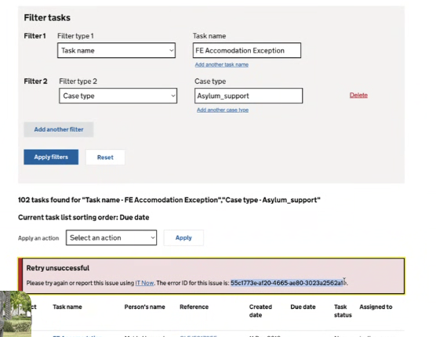
9. change the type for the last one as it is not asylum support
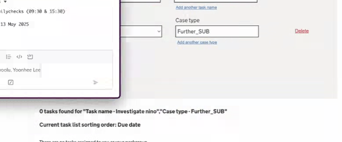
10.   copy the document and past into the change below 
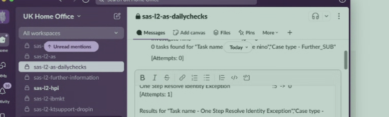

10. the next steps are for the AFTERNOON ONLY
11. get active mq access (go to Asylum Support Operations Guide-> find the access mq link -> copy the vault cmd and run in in terminal to get the password -> the username is admin)
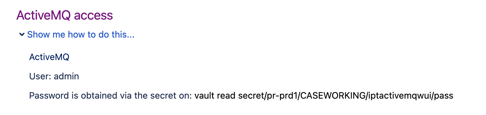
12. log into active mq
13. screen shot the first 4 queues
14. replay them by clicking on first queue (open in new tab)
15. sort by time stamp (decending)
16. click retry on each message ID
17. sort by time stamp again and retry
18. only do the most recent ones - you do not need to redo the ones you just did (if they failed theyll come back to the top thats why you sort by date)
19. when done with the 4 queues, take another screen shot 
20. send to the same channel

# IEBF
## BAD CW
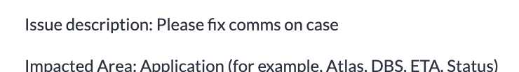
1. bad case worker - no information 
2. cw chase for more info, use the standard response below:

Hi,

Please confirm if you are still experiencing the error?

If so, please provide further information about exactly what the error is and where it occurs, so we can investigate.

Please include any error messages. If it is an Oops Error, please provide the Correlation ID, so we can investigate.

If you have a screenshot of the error as well as the page BEFORE it occurs, please also attach this.

Your Incident will be temporarily suspended until we hear from you. In line with the standard ticket closure policy, if no further contact is received, your Incident will be resolved in 10 working days and then closed a further 10 working days from the resolution date, in-line with the current Incident Management process.

4. tag as chase 1
5. assign to myself
6. awaiting info 

## MERGE 
1. resolve 
2. no fault found 
3. resolution note:
Person Merge is now a caseworking function within Atlas, which can be performed by supervisors.

Duplicated cases can be deleted using edit and delete. Please raise an access request via IT now if you or your team requires.

If you are unsure on how to perform these functions, please follow the guidance on eLearning and Sharepoint, or reach out to a Supervisor for further clarification.

This ticket will now be marked as resolved.

Should problems persist, please contact the ITNow Service Desk and we shall endeavour to assist.
4. If it gets reopened, then change PIS to "Atlas - Manage Person" and config item to "Person Merge"

## OOPS ERROR 
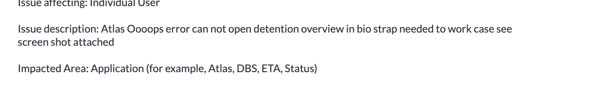
1. copy the correlation ID from the oops error into kibana
2. double check the oops error is still there on Atlas (Detentional review)
3. copy the person ID
4. share short permalink
5. put person id and link in work notes
6. escalate to PA ATLAS IE & BF
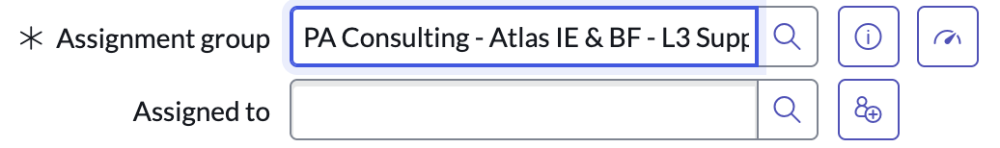
7. tag as **ib-pa-reassign**

## OOPS ERROR 2
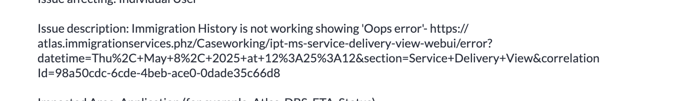
1. follow the above
2. tag as **ls-ib-oops**

## DELETE/ABORT TASK/SERVICE DELIVERY 

1. wanted a dependents removed bc they made an extra one
2. use the triage script and see there are 2 dependants but there are no tasks or cases
3. the caseworkers supervisor can do the deletion

 "
 Administrative Tasks can be actioned by Caseworkers with Supervisor Access Permissions.

Examples include:

- Deleting/Aborting Tasks;
- Deleting Service Deliveries within Case Cards.  (This will then delete the Case Card itself.)
- Re-assigning Tasks and Case Cards.

Please check with your Supervisor (or another colleague in your Team), as they may have been granted Supervisor Access Permissions and if so will be able to carry out this task.

As the system appears to be working correctly we are resolving off this ticket.

Should problems persist, please contact the ITnow Service Desk and we shall endeavour to assist. Please provide as much information as possible in order for SAS L2 to investigate further.
"

4. use this if a case worker wants to abort, reassing or delete a task, delete a service delivery
5. tag as **in-no-issue**
6. resolve as no issue
7. if they've already got a manager to assist then escalate to atlas ie & bf
8. copy the `atlas eventhis [UAN]` of the UAN of what needs to be deleted
9. and do the same for `atlas uan2sddetails [UAN]`
10. place the outputs in work notes

## One step party exception
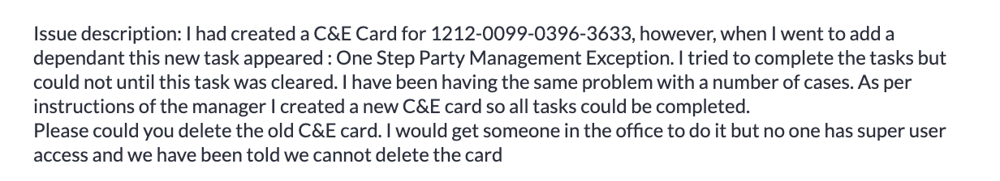
1. search the uan on Atlas
2. check WI to see if this is a exception that can be retried
3. search their name (or uan) on task list
4. retry the task
5. exception won't go
6. copy the exception details (REMOVE THEIR NAME)
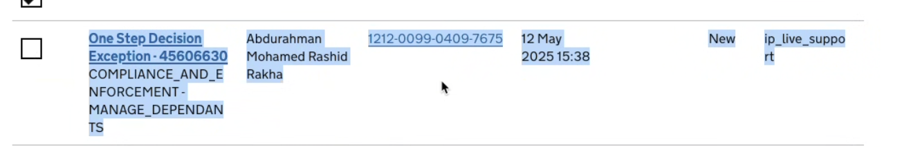
1. paste in work notes - does not clear with retry
2. right click the ref number
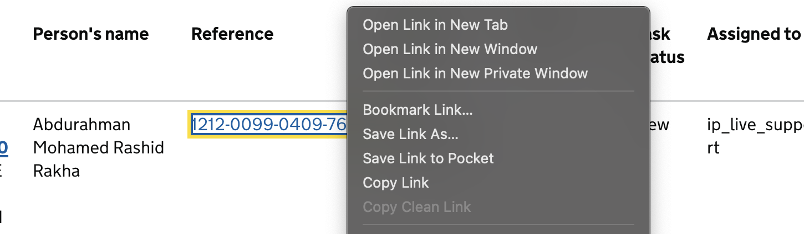
1. paste in work notes
2. copy the service deilvery and search on kibana
3.  copy the short link
4.  search the sddetails on terminal and copy for work notes
5.  escalate to PA ib ef
6.  tag as **ls-ib-exception-replay**

## CHANGE SD STATUS (UNABLE TO RAISE COS ONE IN PROGRESS - NO TASK)

1. in progress service delivery with no tasks that is incomplete
2. find the service delivery numbers for the review barriers sd that are incomplete (there were 2)
3. use the curl comd to change the status of the sds to complete

SD Status Change:
Change status of SD to ABORTED or COMPLETE using the following Curl Commands:
COMPLETE:
curl -v -k -X PUT -H 'Content-Type: application/json' -d '{"refDataValueLongDesc":"COMPLETE","refDataValueId":10603,"refDataValueCode":"COMPLETE","refDataValueShortDesc":"COMPLETE"}' https://ipt-ingestion-services-prd1-prd1.service.pr.iptho.co.uk/ipt-ss-service-delivery-services/services/service-delivery/INSERT_SD_ID/serviceDeliveryStatus

ABORTED:
curl -v -k -X PUT -H 'Content-Type: application/json' -d '{"refDataValueLongDesc":"ABORTED","refDataValueId":10607,"refDataValueCode":"ABORTED","refDataValueShortDesc":"ABORTED"}' https://ipt-ingestion-services-prd1-prd1.service.pr.iptho.co.uk/ipt-ss-service-delivery-services/services/service-delivery/___INSERT_SD_ID___/serviceDeliveryStatus

4. for the in progress - use the complete
5. abort may delete the whole case - use when confirmed w the cw
6. update the cw in the notes, include the sd that have been changed 
7. resolve 
8. tag **ls-ib-sd-inprogress**

# HOTD (home office travel document)

## travel doc status upload 
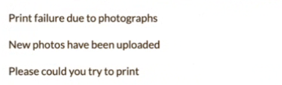
1. find the uan of that sd 
2. check event history
3. find the application sd (normally the longest one)
4. double check that the sd is the  same as the one on atlas 
5. to see if the doc was really no printed - travel_doc_status
6. us the get event cmd - gives more details of the specific event 
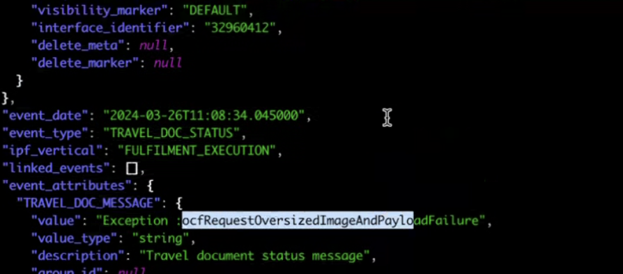
7. shows that the image did not upload
8. reprint needed as the cw has tried to reupload 
9. use atlas hotd_printreg [sd of app]
10. double check that another hotd hasnt been printed
11. confirm yes on terminal
12. run event hist again, see two travel_doc_status normally means be send off
13. double check get event cmd again - the error persists so the photo the cw uploaded was not acceptable
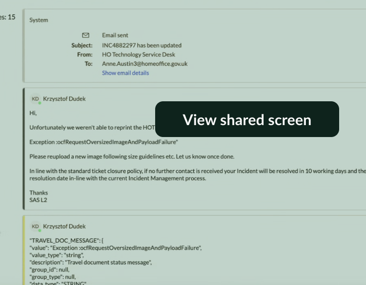
14. tag **HOTD_reprint**

## oops errror 
1. find the info on kibana
2. copy caused by (use cmd + f)
3. copy correlation ID
4. copy person ID from atlas url
5. escalate to pa consulting atlas
6. can see work instruction

## HOTD exception
1. check if cleared on atlas outstanding task? if not check WI, if then resolve
2. click the exception on atlas and see the reasons why - tell the cw (copy the message)
3. check event hist for the applcation
4. get event using the sd
5. see travel_doc_print_status - printed? then the exception has gone through - resolve (no fault found), if not reply to cw using the reasons found on atlas
6. awaiting info for them to reupload then we can retry the exception
7. tag **ls-hotd-printexc**

ATTEMPT TO RETRY ANY EXCEPTIONS ABOUT FROM REPRINT HANDLER

## travel doc didn't print
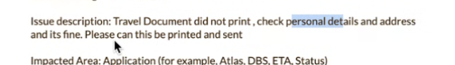
1. check atlas to find the HOTD card
2. check images - photo was uploaded before app, might be the issue (also the image name has special characters)
3. check event hist on terminal
4. get event w the sd nand dravel doc printed
5. says travel doc is printed 
6. expiry date is 2029 - seems correct 
7. get event w notification status - no issue
8. maybe they tried to upload but was unsuccessful bc it's already been printed
9. change to awaiting info
10. tell cw that we've check and it looks fine and ask them to confirm

