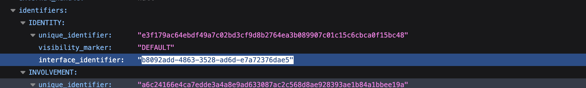
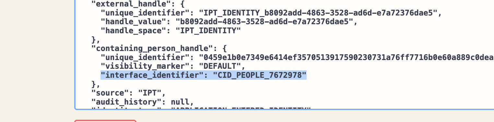

- [To Start](#to-start)
- [escalation](#escalation)
- [Tags](#tags)
- [Short cuts](#short-cuts)
- [commands](#commands)
- [EXCEPTIONS - done twice  a day (9:30 and 15:30)](#exceptions---done-twice--a-day-930-and-1530)
- [DELETE/ABORT TASK/SERVICE DELIVERY (AND C\&E CARDS)](#deleteabort-taskservice-delivery-and-ce-cards)
  - [Manage person - not for us](#manage-person---not-for-us)
  - [task needs to be reinstated](#task-needs-to-be-reinstated)
- [IEBF](#iebf)
  - [VR cards (voluntary return)](#vr-cards-voluntary-return)
  - [BAD CW](#bad-cw)
  - [MERGE](#merge)
  - [DE MERGE](#de-merge)
  - [OOPS ERROR](#oops-error)
  - [OOPS ERROR 2](#oops-error-2)
  - [One step party exception](#one-step-party-exception)
  - [CHANGE SD STATUS (UNABLE TO RAISE COS ONE IN PROGRESS - NO TASK)](#change-sd-status-unable-to-raise-cos-one-in-progress---no-task)
  - [missing CEPR](#missing-cepr)
- [HOTD (home office travel document)](#hotd-home-office-travel-document)
  - [travel doc status upload](#travel-doc-status-upload)
  - [oops errror](#oops-errror)
  - [HOTD exception](#hotd-exception)
  - [travel doc didn't print - see WI](#travel-doc-didnt-print---see-wi)
  - [task on task list but not on atlas](#task-on-task-list-but-not-on-atlas)
  - [inbound on wrong UAN](#inbound-on-wrong-uan)
  - [wrong document uploaded](#wrong-document-uploaded)
- [User access](#user-access)
  - [PIP OOC PERSON SEARCH (should be USER ACCESS)](#pip-ooc-person-search-should-be-user-access)
  - [User cannot access Person Search, receives, (Hmm cannot reach page)  (PIS should be USER ACCESS - send to Zamia)](#user-cannot-access-person-search-receives-hmm-cannot-reach-page--pis-should-be-user-access---send-to-zamia)

# To Start
1. to use the atlas toolbox 
2. `export PATH="/Users/nimota.ogunwoolu/.local/bin:$PATH"`

# escalation 
- Person products (id person search, person summary view) -> Accenture – PPD Level 3 Support – INC

- IEBF -> PA Consulting - Atlas IE & BF - L3 Support - INC

- HODDaT - Immigration Technology Portfolio - Mastek L3 Service Ops

# Tags
**https://confluence.bics-collaboration.homeoffice.gov.uk/pages/viewpage.action?pageId=739517788**

- **ib-pa-reassign** - escalating to L3 PA
- **ls-ib-oops** - oops errors 

# Short cuts 
 - on atlas open all the case history, then cmd f the uan to find the case

# commands

- check_sd_corrids          - Check the correlation ids for service deliveries and output their inconcluded checks with events
- eventhis                  - Get the event history for a service delivery or uan reference
- getevent                  - Get events by event type and service delivery id (eg: atlas getevent 41992773 TRAVEL_DOC_STATUS)
- hotd_printreq             - Build a hotd print request json and write it to the cardrequest endpoint
- psv                       - Build an Atlas url from a service delivery
- sd2cid                    - Convert a service delivery id into a CID case ID
- sd2uan                    - Get a service delivery's assigned UAN
- sddetails                 - Show a detail summary for one or many service deliveries
- ssb                       - SSB search and replay    
- status_grab               - Fetchces the Settlement Status of a UAN
- uan2sd                    - Get a UAN's service deliveries
- uan2sddetails             - Get a UAN's service deliveries and details

# EXCEPTIONS - done twice  a day (9:30 and 15:30)

[EXCEPTION TEMPLATE](exception_retry)

1. go to task list under asylum support
2. follow the document and copy each type on exception in the filter
3. write how many excxeptions before you retry
4. attempt 1 
5. paste the message you got after the retry
6. retry a max of 3 attempt
7. paste how many are left after 3 max retrys
8. the ones that fail (ie. FE Acccomadation) copt the correlation ID to out in the template

9. change the type for the last one as it is not asylum support

10.   copy the document and past into the change below 

10. the next steps are for the AFTERNOON ONLY
11. get active mq access (go to Asylum Support Operations Guide-> find the access mq link -> copy the vault cmd and run in in terminal to get the password -> the username is admin)

12. log into active mq
13. screen shot the first 4 queues
14. replay them by clicking on first queue (open in new tab)
15. sort by time stamp (decending)
16. click retry on each message ID
17. sort by time stamp again and retry
18. only do the most recent ones - you do not need to redo the ones you just did (if they failed theyll come back to the top thats why you sort by date)
19. when done with the 4 queues, take another screen shot 
20. send to the same channel

# DELETE/ABORT TASK/SERVICE DELIVERY (AND C&E CARDS)

1. wanted a dependents removed bc they made an extra one
2. use the triage script and see there are 2 dependants but there are no tasks or cases
3. the caseworkers supervisor can do the deletion
4. use this if a case worker wants to abort, reassing or delete a task, delete a service delivery
5. use .deletetask in resolution notes
6. tag as **ls-ib-no-issue**
7. resolve as no issue
8. if they've already got a manager to assist then escalate to atlas ie & bf
9. copy the `atlas eventhis [UAN]` of the UAN of what needs to be deleted
10. and do the same for `atlas uan2sddetails [UAN]`
11. place the outputs in work notes

## Manage person - not for us
1. 
2. change PIS to manage person 
3. change config item to Managing Checks and Traces (App Svc)
4. "reassigned" in work notes

## task needs to be reinstated 
1. find where the task is deleted and screen shot 
" Hi,

The task was deleted in the screenshot below in error by the case worker, can you please reinstate the task.
UAN: 1212-0099-0411-0456

Kind regards,
L2"
2. change PIS to asylum claim
3. assignment group - HODDaT - "Immigration Technology Portfolio - Mastek L3 Service Ops"

# IEBF

## VR cards (voluntary return)
https://confluence.bics-collaboration.homeoffice.gov.uk/pages/viewpage.action?spaceKey=SM&title=Moving+Voluntary+Return+Cards

1. copy the url of where the VR is currently (wrong person)
2. right click on the tab - pin the old url
3. copy the url for where the VR is going and open the atals profile
4. cd into asylum scripts kt file -> IEBF 
5. place the wrong persons ref number (ie UAN) into the wrongperson.txt
6. place the right person ref nummber (ie CID PERSON) into the correctperson.txt
7. go to the right persons "Identity documents and other references"
8. grab the unique identifier and paste in aukperson.txt file

9. go the the wrong profile and copy the uan
10. use the cmd `atlas uan2sd [UAN]` copy all the sd
11. paste them in the servicedelivery.txt file and keep the format
12. run the cmd `python3 move_sd_and_identities.py` 
13. check the wrong person atlas - vr should be gone
14. check the right person - should have appeared
15. go the vr case card -> grab the APPLICATION sd id
16. go to this endpoint "https://ipt-ingestion-services-prd1-prd1.service.pr.iptho.co.uk/dataplatform-services/v3/event/handle/SERVICE_DELIVERY/type/APPLICATION_ENTERED_IDENTITY/id/{ServiceDeliveryID}?include_deleted=false"
17. replace the {ServiceDeliveryID} with the sd id
18. cmd + f "IDENTIFY - interface_identifier"
 
19. Grab the identifier
20. go to the second endpoint https://ipt-ingestion-services-prd1-prd1.service.pr.iptho.co.uk/dataplatform-services/v2/identity/{IdentityInterfaceID}?include_deleted=false
21.  replace the {IdentityInterfaceID} wiht the one from step 19
22.  Open up the 3rd endpoint 
23.  https://ipt-ingestion-services-prd1-prd1.service.pr.iptho.co.uk/dataplatform-services/api-doc/#/Identity%20V2%20APIs/DPS-IDNT-PUT-003
24.  go to the 2nd endpoint change formatting to RAW PRETTY PRINT (see top left corner)
25.  copy the contents 
26.  past into 3rd endpoint (remove brakckets at the top)
27.  amend the time stap by one sec (26->27)

28. replace identifier below to the correctperson ref

29. excute -> should see code 200
30. refresh endpoint 2 - should see right person ref where it said "containing_person_handle"

31. resolve - "I have moved the VR card from the incorrect PSV to the correct PSV as requested."

## BAD CW

1. bad case worker - no information 
2. cw chase for more info, use the standard response below

Hi,

Please confirm if you are still experiencing the error?

If so, please provide further information about exactly what the error is and where it occurs, so we can investigate.

Please include any error messages. If it is an Oops Error, please provide the Correlation ID, so we can investigate.

If you have a screenshot of the error as well as the page BEFORE it occurs, please also attach this.

Your Incident will be temporarily suspended until we hear from you. In line with the standard ticket closure policy, if no further contact is received, your Incident will be resolved in 10 working days and then closed a further 10 working days from the resolution date, in-line with the current Incident Management process.

3. tag as chase 1
4. assign to myself
5. awaiting info 

## MERGE 
1. resolve 
2. no fault found 
3. resolution note:
Person Merge is now a caseworking function within Atlas, which can be performed by supervisors.

Duplicated cases can be deleted using edit and delete. Please raise an access request via IT now if you or your team requires.

If you are unsure on how to perform these functions, please follow the guidance on eLearning and Sharepoint, or reach out to a Supervisor for further clarification.

This ticket will now be marked as resolved.

Should problems persist, please contact the ITNow Service Desk and we shall endeavour to assist.
4. If it gets reopened, then change PIS to "Atlas - Manage Person" and config item to "Person Merge"

## DE MERGE 
1. Send to HODDaT - IBM Managed Identities - INC
2. "reassigned to merged identity team.

## OOPS ERROR 

1. copy the correlation ID from the oops error into kibana
2. double check the oops error is still there on Atlas (Detentional review)
3. copy the person ID
4. share short permalink
5. put person id and link in work notes
6. escalate to PA ATLAS IE & BF

7. tag as **ib-pa-reassign**

## OOPS ERROR 2

1. follow the above
2. tag as **ls-ib-oops**

## One step party exception

1. search the uan on Atlas
2. check WI to see if this is a exception that can be retried
3. search their name (or uan) on task list
4. retry the task
5. exception won't go
6. copy the exception details (REMOVE THEIR NAME)

1. paste in work notes - does not clear with retry
2. right click the ref number

1. paste in work notes
2. copy the service deilvery and search on kibana
3.  copy the short link
4.  search the sddetails on terminal and copy for work notes
5.  escalate to PA ib ef
6.  tag as **ls-ib-exception-replay**

## CHANGE SD STATUS (UNABLE TO RAISE COS ONE IN PROGRESS - NO TASK)

1. View case details -> Find relevant case history and date. In this case - Electronic Monitoring.
1. in progress service delivery with no tasks that is incomplete
2. find the service delivery numbers for the review barriers sd that are incomplete (there were 2)
3. use the curl comd to change the status of the sds to complete

SD Status Change:
Change status of SD to ABORTED or COMPLETE using the following Curl Commands:
COMPLETE:
curl -v -k -X PUT -H 'Content-Type: application/json' -d '{"refDataValueLongDesc":"COMPLETE","refDataValueId":10603,"refDataValueCode":"COMPLETE","refDataValueShortDesc":"COMPLETE"}' https://ipt-ingestion-services-prd1-prd1.service.pr.iptho.co.uk/ipt-ss-service-delivery-services/services/service-delivery/INSERT_SD_ID/serviceDeliveryStatus

ABORTED:
curl -v -k -X PUT -H 'Content-Type: application/json' -d '{"refDataValueLongDesc":"ABORTED","refDataValueId":10607,"refDataValueCode":"ABORTED","refDataValueShortDesc":"ABORTED"}' https://ipt-ingestion-services-prd1-prd1.service.pr.iptho.co.uk/ipt-ss-service-delivery-services/services/service-delivery/___INSERT_SD_ID___/serviceDeliveryStatus

4. for the in progress - use the complete
5. abort may delete the whole case - use when confirmed w the cw
6. update the cw in the notes, include the sd that have been changed 
7. resolve 
8. tag **ls-ib-sd-inprogress**

Check PIS - in this case it's IE & BF
Go to atlas and go to compliance and enforcement

## missing CEPR

1. escalate to PA IEBF

# HOTD (home office travel document)

## travel doc status upload 

1. find the uan of that sd 
2. check event history
3. find the application sd (normally the longest one)
4. double check that the sd is the  same as the one on atlas 
5. to see if the doc was really no printed - travel_doc_status
6. us the get event cmd - gives more details of the specific event 

7. shows that the image did not upload
8. reprint needed as the cw has tried to reupload 
9. use atlas hotd_printreq [sd of app]
10. double check that another hotd hasnt been printed
11. confirm yes on terminal
12. run event hist again, see two travel_doc_status normally means be send off
13. double check get event cmd again - the error persists so the photo the cw uploaded was not acceptable

14. tag **HOTD_reprint**

## oops errror 
1. find the info on kibana
2. copy caused by (use cmd + f)
3. copy correlation ID
4. copy person ID from atlas url
5. escalate to pa consulting atlas
6. can see work instruction

## HOTD exception
1. check if cleared on atlas outstanding task? if not check WI, if then resolve
2. click the exception on atlas and see the reasons why - tell the cw (copy the message)
3. check event hist for the applcation
4. get event using the sd
5. see travel_doc_print_status - printed? then the exception has gone through - resolve (no fault found), if not reply to cw using the reasons found on atlas
6. awaiting info for them to reupload then we can retry the exception
7. tag **ls-hotd-printexc**

**ATTEMPT TO RETRY ANY EXCEPTIONS APART FROM REPRINT HANDLER**

## travel doc didn't print - see WI

1. check atlas to find the HOTD card
2. check images - photo was uploaded before app, might be the issue (also the image name has special characters)
3. check event hist on terminal - `atlas eventhis [UAN]`
4. get event w the sd and "travel_doc_status" - `atlas getevent [UAN] [EVENT_TYPE]`
5. says travel doc is printed 
6. expiry date is 2029 - seems correct 
7. get event w notification status - no issue
8. maybe they tried to upload but was unsuccessful bc it's already been printed
9.  change to awaiting info
10. tell cw that we've check and it looks fine and ask them to confirm

11. If travel_doc_status says error - send to PA consulting atlas

12. if styck in wwait - no printed - send to PA ATLAS

## task on task list but not on atlas

1. Get UAN and check on Atlas.
2. If there is outstanding task with register -> send PA Consulting - Atlas - L3 Support - INC
3. If none, issue solved. (This used to be common issue but now its fixed by L3)
4. In this incident, they need Register task but it's not showing -> send PA Consulting - Atlas - L3 Support - INC 

## inbound on wrong UAN
1. escalate to PA-CONSULTING-ATLAS

## wrong document uploaded

1. copy the url from /caseworking
2. paste into any random atlas web address from the /casworking 
3. you should see the document id

4. run the cmd `atlas doc_replacement`
5. paste the doc id
6. paste the INC number 

7. refresh the page the cw gave and see if the document is blank
8. if black then resolve

# User access
1. assign to zamia 

## PIP OOC PERSON SEARCH (should be USER ACCESS)

## User cannot access Person Search, receives, (Hmm cannot reach page)  (PIS should be USER ACCESS - send to Zamia)

1. Click the little (i) icon next to the requesters name, and it'll show you additiional fields, crucially their poiseID
2.  Check user PoiseID in openLDAP: https://atlas.service.pr.iptho.co.uk/Caseworking/ipt-ms-openldapadmin-webui/
Looks ok, user has permission groups 1-3
1. Check user poiseID in RHSSO:
https://atlas-sysebsaiprd1.service.pr.iptho.co.uk/auth/admin/master/console/#/realms/immigrationportfolio/users
Looks ok, user has openLDAP groups assigned to them.
1. verify user is using correct link: yeah all good
2. look for additional reasons, can see the user doesn't have a homeoffice email, it was changed to @jmsc.gov.uk 2 weeks ago, this is the likely cause,
3. Resolution notes:
"Hi, your permissions look fine in Atlas, this is most likely related to the domain change from homeoffice to jmsc, can you please liase with your manager to get access to Atlas again, it may be you need a different route to access than when you were in the home office domain.
The root cause could be your PoiseID has changed, your Single Sign on information is now different, or are you using a different laptop or working from a different location?" 