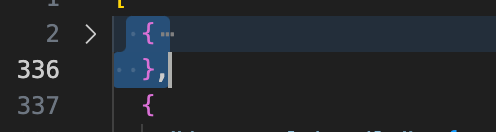
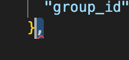
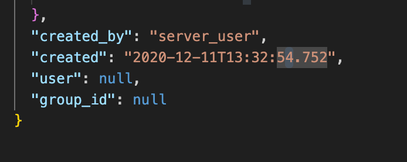
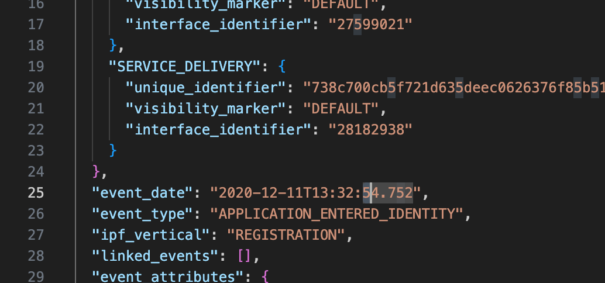

## Missing options on the drop down 

1. Go on atlas and check that the drop down only shows a few options
2. Go on terminal and `source bash_profile` or `source .bash_profile`
3. Use the cmd `eventhis [SD ID]` - The service delivery must be of the related inbound/outbound contact (check atlas)
4. This will give a json file 

5. Open finder and use cmd + shift + G and paste the path to the json file
6. Open the file in vscode or any text editor
7. Collapse line 2 and copy

8. Cmd + A to select the whole file contents, cmd + V to paste the 2nd line that was just copied
9. Scroll to the bottom and remove the comma

10. Increase the time by one second at the bottom

11. Do the same for the top

12. Copy the whole file, paste in this swagger page (click try it out)) - https://ipt-ingestion-services-prd1-prd1.service.pr.iptho.co.uk/dataplatform-services/api-doc/#/Event%20History%20V3%20APIs/DPS-EVENT-PUT-005
13.  Execute and the code should be 200
14.  Go to the psv and the menu should now have more options - resolve